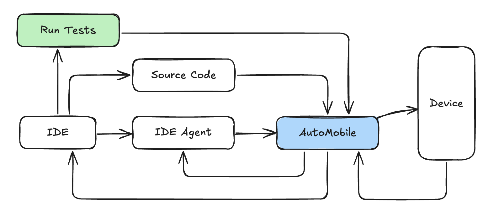

# AutoMobile

AutoMobile is a set of tools for mobile automation. You can use it for UI testing or as a development workflow
assistant.

The first platform supported is Android with plans to extend to iOS.

## How it works

- 🔧 **[Powerful MCP Server](docs/features/mcp-server/index.md)**: AutoMobile provides comprehensive [actions](docs/features/mcp-server/actions.md) through MCP
  tool calls with a fast [observations](docs/features/mcp-server/observation.md) to drive the
  [interaction loop](docs/features/mcp-server/interaction-loop.md).
- 🗺️ **Source Mappping**: Combining project path config with deep view hierarchy analysis we know exactly what code is being rendered.
- ✍️ **[Automated Test Authoring](docs/features/test-authoring/index.md)**: When used in test authoring mode AutoMobile will write tests for you. It is the only way it writes tests.
- 🧪 **[Test Execution](docs/features/test-execution/index.md)** - Run tests locally or on CI without extra infrastructure.
- 📱 **Device Management**: Multi-device support with emulator control and app lifecycle management.

All together you get a system that looks like this:

## Documentation

- 💻 [Installation & Getting Started](docs/installation.md) - AutoMobile is [published on npm](https://www.npmjs.com/package/auto-mobile)
  and we have instructions for agents we've tested with.
- 📝 [Change Log](CHANGELOG.md) - coming soon

## Contributing

- [Code of Conduct](CODE_OF_CONDUCT.md)
- [Responsible disclosure & use](SECURITY.md)
- [Contributing](.github/CONTRIBUTING.md) - coming soon

# Acknowledgement 

By continuing to use AutoMobile, [you acknowledge and agree to the warnings and responsible use requirements](SECURITY.md).
