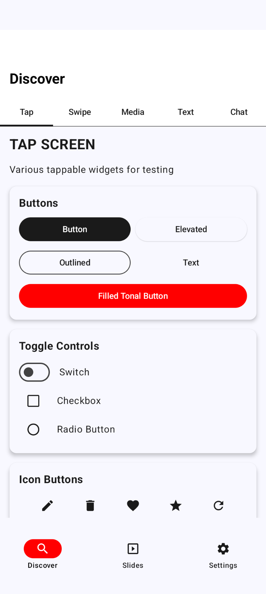
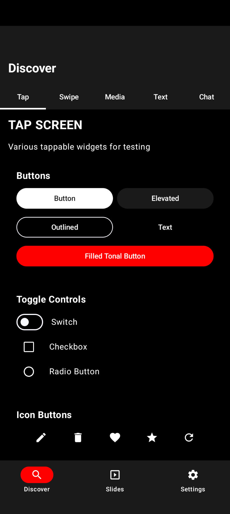
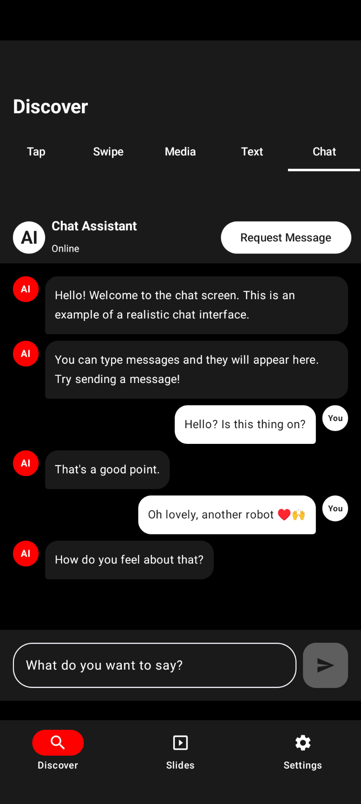
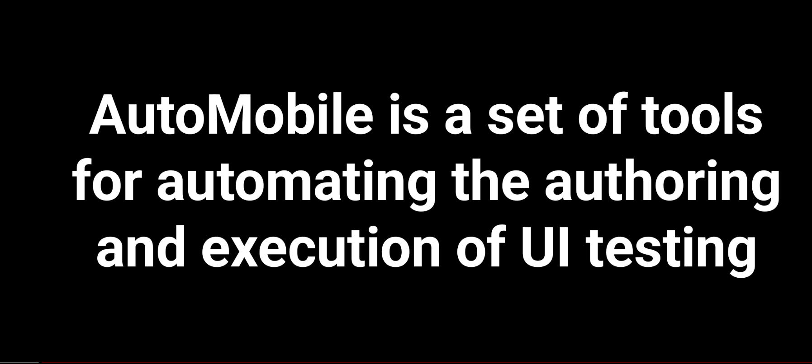
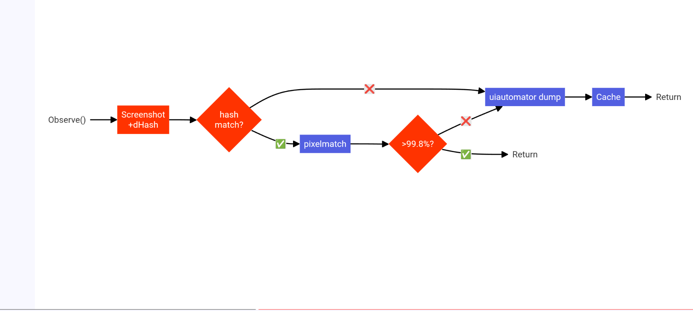
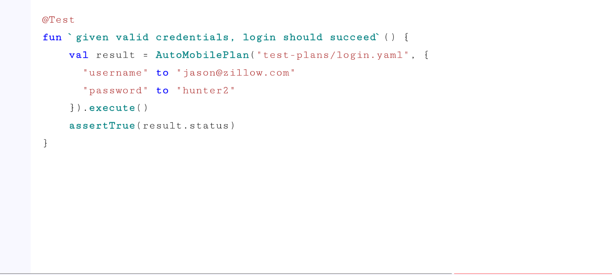

# 🎮 AutoMobile Android Playground

The AutoMobile Android Playground is a demonstration app designed to test and showcase AutoMobile's automation
capabilities. Its purpose is:

1. **🎯 Serve as a test target** - Provides a controlled Android app environment for AutoMobile to interact with and
   automate, both to make itself better and to improve its playground.
2. **🚀 Use modern Android development** - Built with 100% Jetpack Compose UI, Nav3, Material3, and modern Android
   patterns.
3. **📦 Minimal dependencies** - No dependency injection frameworks or network calls to keep it simple and self-contained.
4. **🎨 Feature variety** - Includes multiple modules (login, home, settings, media player, onboarding, etc.) to test
   different UI patterns and Experiment/Treatment context awareness.
5. **📸 Media capabilities** - Integrates Coil for image loading and ExoPlayer for video playback.

| Light Mode | Dark Mode |
|------------|-----------|
|  |  |
|  |  |

It also includes the original Droidcon NYC 2025 slides with complex presentation functionality.

