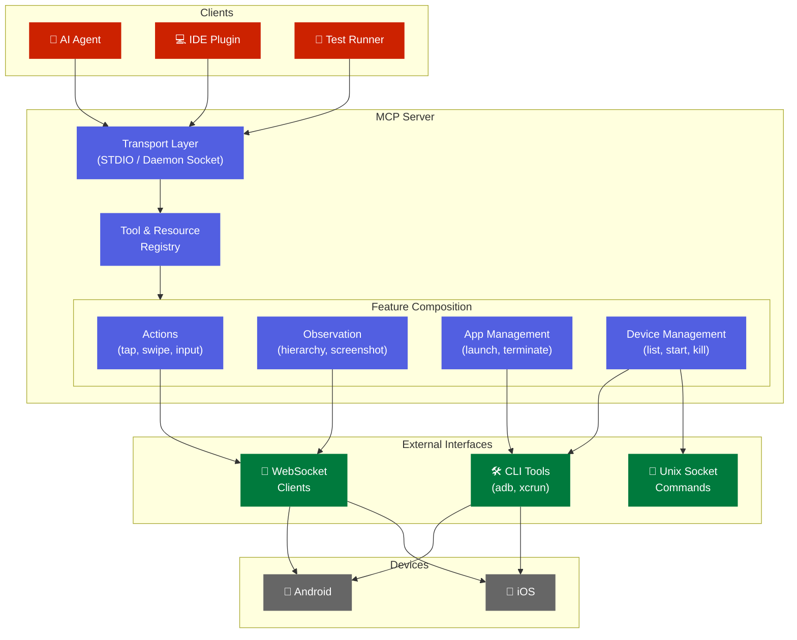

# Design Documentation

Technical architecture and design details for AutoMobile.

## Overview

AutoMobile is a mobile UI automation framework built on the Model Context Protocol (MCP). It enables AI agents to interact with Android and iOS devices for testing, exploration, and automation.

## Core Components

| Component | Description |
|-----------|-------------|
| [MCP Server](mcp/index.md) | Protocol server enabling AI agent interaction |
| [Interaction Loop](mcp/interaction-loop.md) | Observe-act-observe cycle with idle detection |
| [Observation](mcp/observe/index.md) | Real-time UI hierarchy and screen capture |
| [Actions](mcp/tools.md) | Touch, swipe, input, and app management |
| [Navigation Graph](mcp/nav/index.md) | Automatic screen flow mapping |
| [Daemon](mcp/daemon/index.md) | Device pooling and test execution |

## Design Principles

High quality, performant, and accessible workflows are necessary to creating good software.

1. **Fast & Accurate** - Mobile UX can change instantly so slow observations translate to lower quality analysis.
2. **Reliable Element Search** - Multiple strategies with integrated vision fallback.
3. **Autonomous Operation** - AI agents explore without human guidance or intervention.
4. **CI/CD Ready** - Built for automated testing pipelines, dogfooding the tool to test itself.
5. **Accessible** - You shouldn't need to be a build engineer or AI expert to use AutoMobile.

## Status

Feature implementation status is indicated throughout these docs using chips. See the [Status Glossary](status-glossary.md) for chip definitions and the master list of unimplemented and partially-implemented features.

## Platform Support

### Android

| Component | Purpose | Status |
|-----------|---------|--------|
| [Accessibility Service](plat/android/control-proxy.md) | Real-time view hierarchy access | <kbd>✅ Implemented</kbd> <kbd>🧪 Tested</kbd> |
| [JUnitRunner](plat/android/junit-runner/index.md) | Test execution framework | <kbd>✅ Implemented</kbd> <kbd>🧪 Tested</kbd> |
| [IDE Plugin](plat/android/ide-plugin/overview.md) | Android Studio integration | <kbd>✅ Implemented</kbd> |
| [Work Profiles](plat/android/work-profiles.md) | Enterprise device support | <kbd>✅ Implemented</kbd> <kbd>🧪 Tested</kbd> |

### iOS

| Component | Purpose | Status |
|-----------|---------|--------|
| [iOS Overview](plat/ios/index.md) | Architecture and status | <kbd>📱 Simulator Only</kbd> |
| [CtrlProxy iOS](plat/ios/ctrl-proxy-ios.md) | WebSocket automation server | <kbd>✅ Implemented</kbd> <kbd>🧪 Tested</kbd> |
| [XCTestRunner](plat/ios/xctestrunner/index.md) | Test execution framework | <kbd>✅ Implemented</kbd> <kbd>🧪 Tested</kbd> |
| [Xcode Integration](plat/ios/ide-plugin/overview.md) | Companion app + editor extension | <kbd>⚠️ Partial</kbd> |
