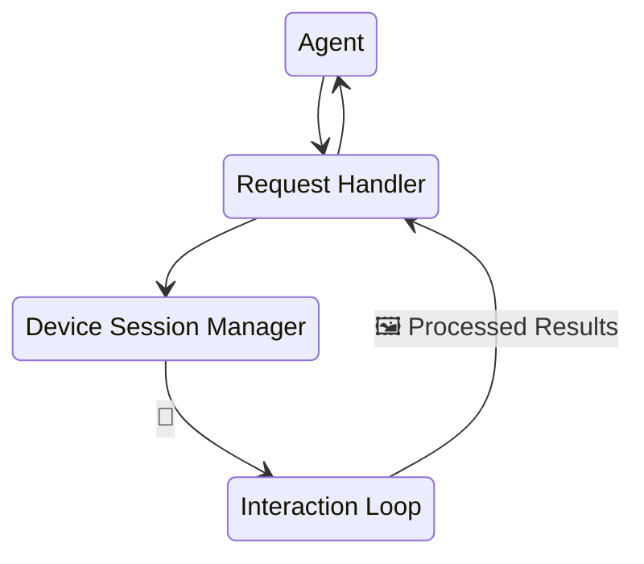

# Design Documentation

Technical architecture and design details for AutoMobile.

## Design Principles

High quality, performant, and accessible workflows are necessary to creating good software.

1. **Fast & Accurate** - Mobile UX can change instantly so slow observations translate to lower quality analysis.
2. **Reliable Element Search** - Multiple strategies with integrated vision fallback.
3. **Autonomous Operation** - AI agents explore without human guidance or intervention.
4. **CI/CD Ready** - Built for automated testing pipelines, dogfooding the tool to test itself.
5. **Accessible** - You shouldn't need to be a build engineer or AI expert to use AutoMobile.

## Overview

AutoMobile is a mobile UI automation framework built on the Model Context Protocol (MCP). It enables AI agents to interact with Android and iOS devices for testing, exploration, and automation.

## Core Components

| Component | Description |
|-----------|-------------|
| [MCP Server](mcp/index.md) | Protocol server enabling AI agent interaction |
| [Interaction Loop](mcp/interaction-loop.md) | Observe-act-observe cycle with idle detection |
| [Observation](mcp/observe/index.md) | Real-time UI hierarchy and screen capture |
| [Actions](mcp/tools.md) | Touch, swipe, input, and app management |
| [Navigation Graph](mcp/nav/index.md) | Automatic screen flow mapping |
| [Daemon](mcp/daemon/index.md) | Device pooling and test execution |

## Platform Support

### Android

| Component | Purpose |
|-----------|---------|
| [Accessibility Service](plat/android/accessibility-service.md) | Real-time view hierarchy access |
| [JUnitRunner](plat/android/junitrunner.md) | Test execution framework |
| [IDE Plugin](plat/android/ide-plugin/overview.md) | Android Studio integration |
| [Work Profiles](plat/android/work-profiles.md) | Enterprise device support |

### iOS (Planned)

| Component | Purpose |
|-----------|---------|
| [iOS Overview](plat/ios/index.md) | Architecture and roadmap |
| [Accessibility Bridge](plat/ios/accessibility-service.md) | WebSocket automation server |
| [XCTest Runner](plat/ios/xctestrunner.md) | Test execution framework |
| [Xcode Integration](plat/ios/ide-plugin/overview.md) | Editor extension |

