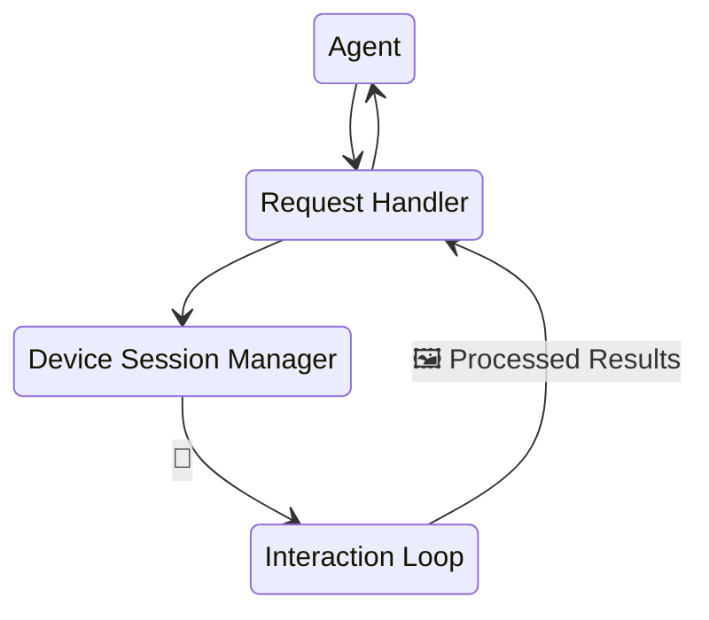

# AutoMobile Design Documentation

Technical design documents and architecture details for AutoMobile.

AutoMobile is a mobile UI automation framework built around the Model Context Protocol (MCP). It enables AI agents to interact with Android and iOS devices for testing, exploration, and automation.

## Architecture

### Core Components

- **[MCP Server](mcp/index.md)** - Model Context Protocol server enabling AI agent interaction
- **[Interaction Loop](mcp/interaction-loop.md)** - Core observation and action cycle
- **[Platform Integrations](plat/android/index.md)** - Android and iOS specific implementations

### Key Features

- **[Observation](mcp/observation.md)** - Real-time UI hierarchy and screen capture
- **[Actions](mcp/actions.md)** - Touch, swipe, and input automation
- **[Navigation Graph](mcp/navigation-graph.md)** - Automatic screen flow mapping
- **[Daemon](mcp/daemon.md)** - Background service for device pooling and test execution
- **[Feature Flags](mcp/feature-flags.md)** - Runtime configuration and experimental features

## Platform-Specific

### Android
- **[Accessibility Service](plat/android/accessibility-service.md)** - Real-time view hierarchy access
- **[JUnitRunner](plat/android/junitrunner.md)** - Test execution framework
- **[IDE Plugin](plat/android/ide-plugin/overview.md)** - Android Studio integration
- **[Work Profiles](plat/android/work-profiles.md)** - Enterprise device support

### iOS
- **[iOS Support](plat/ios/index.md)** - iOS automation capabilities (in development)

## System Design Principles

1. **Fast Observation** - UI hierarchy and screen state captured in <100ms
2. **Reliable Element Finding** - Multiple strategies with vision fallback
3. **Autonomous Operation** - AI agents can explore without human guidance
4. **CI/CD Ready** - Designed for automated testing in continuous integration

## Contributing

See [Contributing Guide](../contributing/index.md) for how to contribute to AutoMobile.
