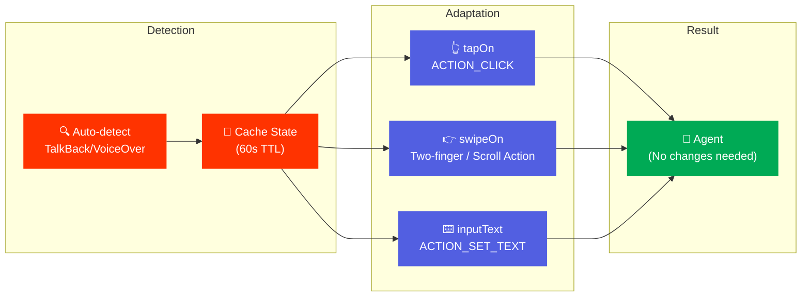

# Overview

AutoMobile supports accessibility testing by detecting and adapting to screen readers like TalkBack (Android) and VoiceOver (iOS).

## Design Principles

1. **Auto-detect and adapt** - Tools automatically detect screen readers and adjust behavior
2. **Backward compatible** - No changes to existing tool interfaces or automation scripts
3. **Transparent** - Behavior adaptations invisible to MCP consumers (agents)
4. **Performance** - Detection cached with <50ms overhead

## Key Adaptations

| Tool | Standard Mode | Screen Reader Mode |
|------|---------------|-------------------|
| `tapOn` | Coordinate tap | `ACTION_CLICK` on element |
| `swipeOn` | Single-finger swipe | Two-finger swipe or `ACTION_SCROLL_*` |
| `inputText` | `ACTION_SET_TEXT` | No change (already accessible) |
| `pressButton` | Hardware keyevent | Optional `GLOBAL_ACTION_BACK` |

## Topics

| Document | Description |
|----------|-------------|
| [TalkBack/VoiceOver Adaptation](talkback-voiceover.md) | Complete design for screen reader support |

## Platform Support

| Platform | Screen Reader | Status |
|----------|---------------|--------|
| Android | TalkBack | Primary focus |
| iOS | VoiceOver | Planned |

