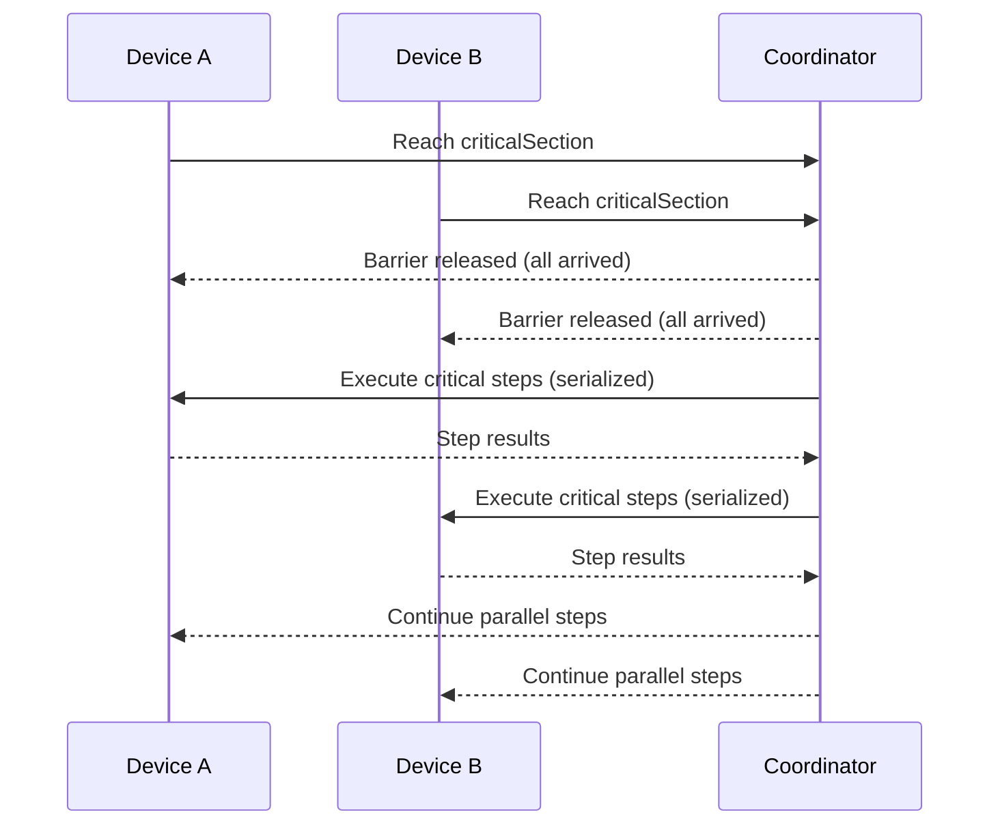
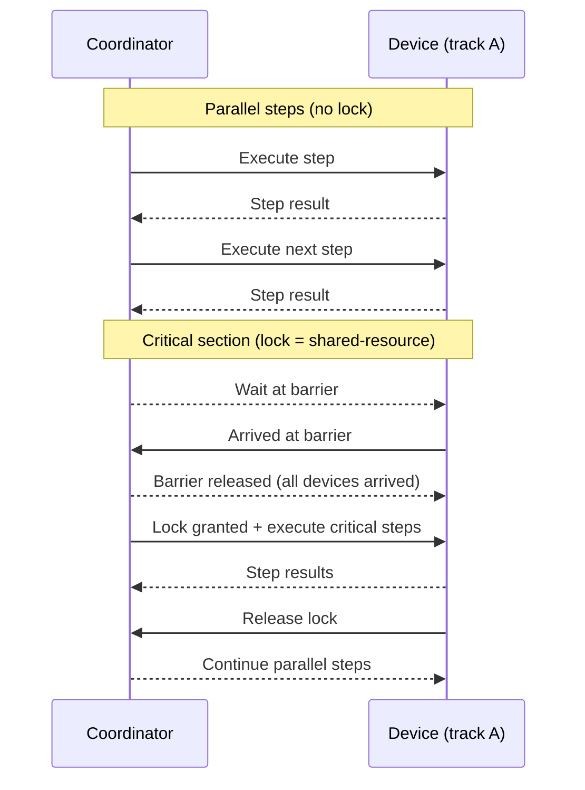

# Critical Section Tool

## Overview

The `criticalSection` tool provides multi-device synchronization for serialized execution of steps. It implements a barrier synchronization pattern where all devices must arrive at the critical section before any can proceed, and then executes steps one device at a time.

## Availability

The `criticalSection` tool is available only when the AutoMobile daemon is running (daemon-backed MCP server). It is not registered in standalone MCP mode.

## Use Cases

Critical sections are useful when you need to:

1. **Serialize resource access**: Ensure only one device at a time accesses a shared resource (e.g., payment processing, database writes)
2. **Prevent race conditions**: Coordinate state changes across devices that must not interleave
3. **Synchronize multi-device tests**: Ensure devices reach specific test milestones together before proceeding
4. **Order-dependent operations**: Guarantee specific execution order for operations that affect shared state

## How It Works

### Barrier Synchronization

1. **Registration**: Each device registers the expected number of devices for the lock
2. **Arrival**: Devices arrive at the critical section and wait at a barrier
3. **Release**: Once ALL expected devices arrive, they are released from the barrier
4. **Serial Execution**: Devices acquire a mutex and execute their steps one at a time
5. **Cleanup**: After execution, the lock is released and resources are cleaned up

### Execution Flow

#### High-Level Flow (No Lock Details)



#### Device-Level Flow (Parallel + Critical Section with Locking)



## Tool Schema

```typescript
{
  lock: string;              // Global lock identifier
  steps: PlanStep[];         // Steps to execute serially
  deviceCount: number;       // Number of devices expected at barrier
  timeout?: number;          // Barrier timeout in ms (default: 30000)
}
```

### Parameters

- **`lock`** (required): Global lock identifier. All devices using the same lock name will wait for each other at this barrier.
  - Scope: Global across all sessions
  - Must be unique per synchronization point
  - Different locks can run concurrently

- **`steps`** (required): Array of plan steps to execute serially within the critical section.
  - Minimum: 1 step
  - Each step should target a specific device using the `device` parameter
  - Steps are executed in order, one device at a time
  - Nested critical sections are NOT supported (will throw error)

- **`deviceCount`** (required): Total number of devices expected to reach this critical section.
  - Must be positive integer
  - All devices must specify the same count for the same lock
  - Barrier will only release when exactly this many devices arrive

- **`timeout`** (optional): Maximum time in milliseconds to wait at the barrier.
  - Default: 30000 (30 seconds)
  - If timeout expires before all devices arrive, all waiting devices will fail
  - Use longer timeouts for slower operations or larger device counts

## Usage Examples

### Basic Two-Device Synchronization

```yaml
steps:
  # Device A waits at barrier
  - tool: criticalSection
    params:
      device: A
      lock: payment-sync
      deviceCount: 2
      steps:
        - tool: tapOn
          params:
            device: A
            text: Process Payment
        - tool: observe
          params:
            device: A

  # Device B waits at barrier, then both execute serially
  - tool: criticalSection
    params:
      device: B
      lock: payment-sync
      deviceCount: 2
      steps:
        - tool: tapOn
          params:
            device: B
            text: Process Payment
        - tool: observe
          params:
            device: B
```

### Three-Device Coordination

```yaml
steps:
  - tool: criticalSection
    params:
      device: A
      lock: shared-resource
      deviceCount: 3
      steps:
        - tool: tapOn
          params:
            device: A
            text: Access Resource

  - tool: criticalSection
    params:
      device: B
      lock: shared-resource
      deviceCount: 3
      steps:
        - tool: tapOn
          params:
            device: B
            text: Access Resource

  - tool: criticalSection
    params:
      device: C
      lock: shared-resource
      deviceCount: 3
      steps:
        - tool: tapOn
          params:
            device: C
            text: Access Resource
```

### Multiple Independent Critical Sections

```yaml
steps:
  # First critical section - payment processing
  - tool: criticalSection
    params:
      device: A
      lock: payment-lock
      deviceCount: 2
      steps:
        - tool: tapOn
          params:
            device: A
            text: Pay

  - tool: criticalSection
    params:
      device: B
      lock: payment-lock
      deviceCount: 2
      steps:
        - tool: tapOn
          params:
            device: B
            text: Pay

  # Second critical section - data sync (independent from payment)
  - tool: criticalSection
    params:
      device: A
      lock: sync-lock
      deviceCount: 2
      steps:
        - tool: tapOn
          params:
            device: A
            text: Sync

  - tool: criticalSection
    params:
      device: B
      lock: sync-lock
      deviceCount: 2
      steps:
        - tool: tapOn
          params:
            device: B
            text: Sync
```

## Error Handling

### Timeout Errors

If not all devices reach the barrier within the timeout period:

```
Error: Timeout waiting for critical section "payment-lock".
2/3 devices arrived after 30000ms.
Missing devices may have failed or not reached the critical section.
```

**Resolution**:
- Check that all devices are reaching the critical section
- Increase timeout if devices need more time
- Verify deviceCount is correct

### Nesting Errors

If a critical section step contains another critical section:

```
Error: Nested critical sections are not supported.
Found criticalSection step inside critical section "outer-lock".
```

**Resolution**:
- Remove nested critical sections
- Use different lock names for sequential synchronization points

### Invalid Device Count

If deviceCount is invalid:

```
Error: Invalid device count 0 for lock "payment-lock". Must be at least 1.
```

**Resolution**:
- Ensure deviceCount is a positive integer
- Verify all devices specify the same count

### Step Execution Failure

If a step fails inside the critical section:

```
Error: Critical section "payment-lock" failed for device device-A:
Failed at step 2/3 (observe): Element not found
```

**Behavior**:
- Execution stops immediately (fail-fast)
- Lock is released
- Other waiting devices will timeout
- Resources are cleaned up

## Best Practices

### 1. Use Descriptive Lock Names

```yaml
# Good
lock: payment-processing-sync

# Bad
lock: lock1
```

### 2. Keep Critical Sections Small

Minimize the number of steps inside critical sections to reduce serialization overhead.

```yaml
# Good - only serialize the critical operation
steps:
  - tool: tapOn
    params:
      device: A
      text: Navigate to Payment  # Outside critical section

  - tool: criticalSection
    params:
      device: A
      lock: payment
      deviceCount: 2
      steps:
        - tool: tapOn
          params:
            device: A
            text: Submit Payment  # Only this needs serialization

# Bad - unnecessary serialization
steps:
  - tool: criticalSection
    params:
      device: A
      lock: payment
      deviceCount: 2
      steps:
        - tool: launchApp        # Doesn't need serialization
        - tool: tapOn
          params:
            text: Navigate
        - tool: tapOn
          params:
            text: Submit Payment
```

### 3. Set Appropriate Timeouts

Consider the worst-case execution time for all devices to arrive:

```yaml
# For fast operations
timeout: 10000  # 10 seconds

# For slow operations or many devices
timeout: 60000  # 60 seconds
```

### 4. Match Device Counts Exactly

All devices must agree on the device count:

```yaml
# Good
- tool: criticalSection
  params:
    device: A
    lock: sync
    deviceCount: 2  # ✓

- tool: criticalSection
  params:
    device: B
    lock: sync
    deviceCount: 2  # ✓

# Bad - will timeout!
- tool: criticalSection
  params:
    device: A
    lock: sync
    deviceCount: 2  # Device A expects 2

- tool: criticalSection
  params:
    device: B
    lock: sync
    deviceCount: 3  # Device B expects 3 - MISMATCH!
```

### 5. Use Different Locks for Independent Operations

Don't reuse lock names for unrelated synchronization points:

```yaml
# Good
- tool: criticalSection
  params:
    lock: payment-sync
    # ...

- tool: criticalSection
  params:
    lock: data-sync
    # ...

# Bad - reusing same lock
- tool: criticalSection
  params:
    lock: my-lock  # First sync point
    # ...

- tool: criticalSection
  params:
    lock: my-lock  # Second sync point - PROBLEMATIC!
    # ...
```

## Limitations

1. **No Nesting**: Critical sections cannot be nested. Each lock must be distinct.

2. **Global Scope**: Lock names are globally unique. Different sessions cannot use the same lock name simultaneously without interfering.

3. **No Re-entry**: A device cannot enter the same critical section twice without cleanup.

4. **Fail-Fast**: If any device fails inside the critical section, all devices fail. There is no partial success mode.

5. **Static Device Count**: The device count must be known upfront and cannot change during execution.

## Implementation Details

### Coordinator

The `CriticalSectionCoordinator` is a singleton that manages:
- Global lock registry (using `async-mutex`)
- Barrier synchronization tracking
- Expected device counts
- Timeout handling
- Resource cleanup

### Cleanup

Resources are cleaned up automatically:
- **5 seconds** after the last device releases the lock
- **Immediately** on error via `forceCleanup()`

### Thread Safety

The coordinator uses:
- `async-mutex` for lock acquisition
- Promise-based barrier synchronization
- Timeout-based failure detection

## Testing

Comprehensive tests cover:
- Single device execution
- Multi-device barrier synchronization
- Serial execution verification
- Timeout handling
- Nesting detection
- Cleanup behavior
- Multiple independent locks
- Force cleanup
- Reregistration after cleanup

Run tests:
```bash
bun test test/server/CriticalSectionCoordinator.test.ts
```

## See Also

- [critical-section-example.yaml](../../critical-section-example.yaml) - Complete working example
