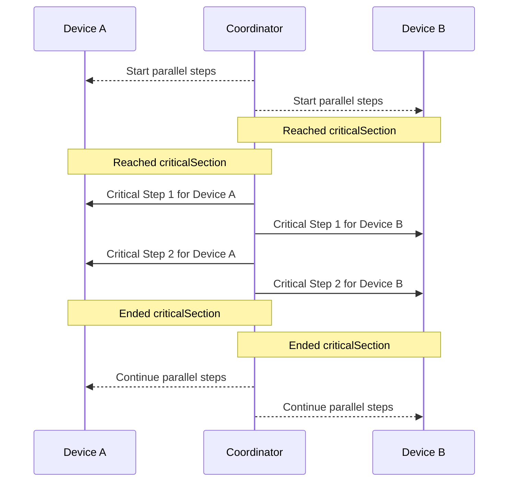
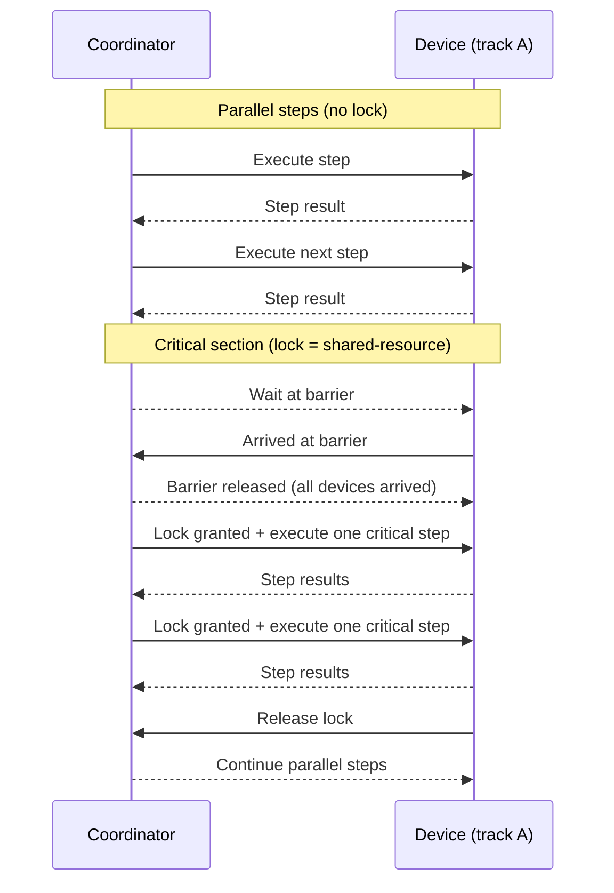

# Critical Section

## Overview

The 🔒 [`criticalSection`](../tools.md) tool provides multi-device synchronization for serialized execution of steps. It implements a barrier synchronization pattern where all devices must arrive at the critical section before any can proceed, and then executes steps one device at a time.

## Availability

The 🔒 `criticalSection` tool is available only when AutoMobile runs as an [MCP Daemon](index.md). It is not registered in standalone MCP mode.

## Use Cases

Critical sections are useful when you need to:

1. **Serialize resource access**: Ensure only one device at a time accesses a shared resource (e.g., payment processing, database writes)
2. **Prevent race conditions**: Coordinate state changes across devices that must not interleave
3. **Synchronize multi-device tests**: Ensure devices reach specific test milestones together before proceeding
4. **Order-dependent operations**: Guarantee specific execution order for operations that affect shared state

## How It Works

### Barrier Synchronization

1. **Registration**: Each device registers the expected number of devices for the lock
2. **Arrival**: Devices arrive at the critical section and wait at a barrier
3. **Release**: Once ALL expected devices arrive, they are released from the barrier
4. **Serial Execution**: Devices acquire a mutex and execute their steps one at a time
5. **Cleanup**: After execution, the lock is released and resources are cleaned up

### Execution Flow

#### High-Level Flow (No Lock Details)



#### Device-Level Flow (Parallel + Critical Section with Locking)



## Usage Examples

### Two-Device Synchronization Check

```yaml
steps:
  - tool: navigateTo
    params:
      device: A
      text: Edit Profile
  - tool: tapOn
    params:
      device: A
      text: Clear Status
  - tool: navigateTo
    params:
      device: A
      text: Search
  - tool: inputText
    params:
      device: B
      text: Test User A
  - tool: imeAction
    params:
      device: B
      text: done
  - tool: criticalSection
    params:
      lock: profile-sync
      deviceCount: 2
      steps:
        - tool: tapOn
          params:
            device: A
            text: Edit Profile
        - tool: tapOn
          params:
            device: A
            text: Status
        - tool: inputText
          params:
            device: A
            text: Pretty awesome
        - tool: tapOn
          params:
            device: A
            text: Clear Status
        - tool: observe
          params:
            device: B
            await:
              - text: No Status
        - tool: tapOn
          params:
            device: A
            text: Save profile
        - tool: observe
          params:
            device: B
            await:
              - text: Pretty awesome
```

## Error Handling

### Timeout Errors

If not all devices reach the barrier within the timeout period:

```yaml
Error: Timeout waiting for critical section "payment-lock".
2/3 devices arrived after 30000ms.
Missing devices may have failed or not reached the critical section.
```

**Resolution**:
- Check that all devices are reaching the critical section
- Increase timeout if devices need more time
- Verify deviceCount is correct

### Nesting Errors

If a critical section step contains another critical section:

```yaml
Error: Nested critical sections are not supported.
Found criticalSection step inside critical section "outer-lock".
```

**Resolution**:
- Remove nested critical sections
- Use different lock names for sequential synchronization points

### Step Execution Failure

If a step fails inside the critical section:

```yaml
Error: Critical section "payment-lock" failed for device device-A:
Failed at step 2/3 (observe): Element not found
```

**Behavior**:
- Execution stops immediately (fail-fast)
- Lock is released
- Other waiting devices will timeout
- Resources are cleaned up

## Limitations

1. **No Nesting**: Critical sections cannot be nested. Each lock must be distinct.

4. **Fail-Fast**: If any device fails inside the critical section, all devices fail. There is no partial success mode.

5. **Static Device Count**: The device count must be known upfront and cannot change during execution.
