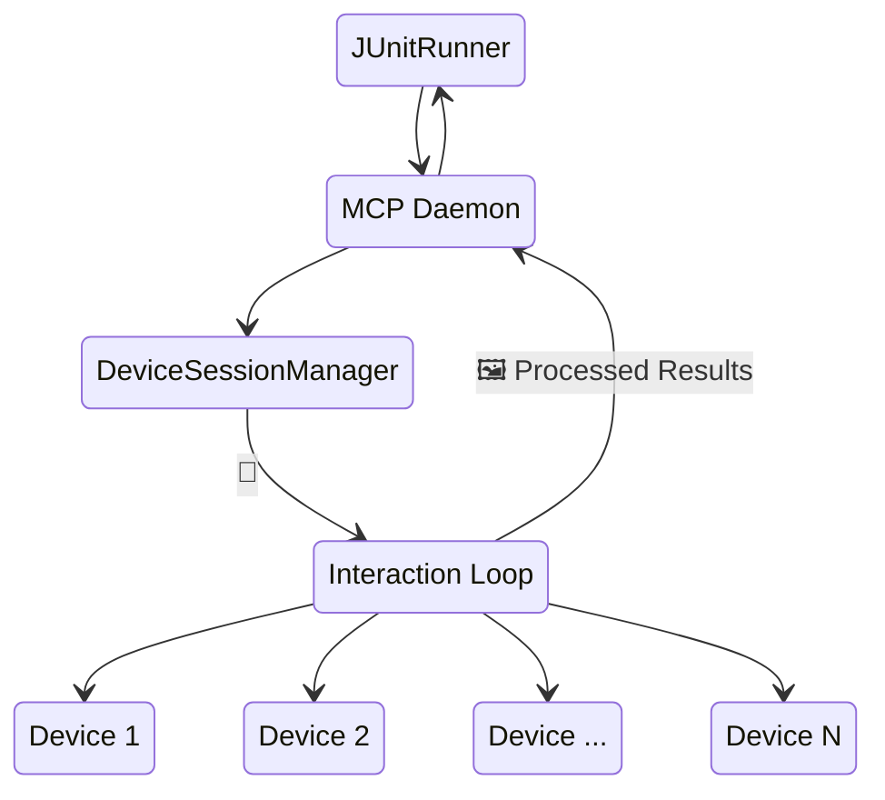

# Overview

<kbd>✅ Implemented</kbd> <kbd>🧪 Tested</kbd>

> **Current state:** Daemon mode is fully implemented. Device pool management, session allocation, Unix socket communication, and test timing tracking are all active. See the [Status Glossary](../../status-glossary.md) for chip definitions.

Background daemon service for device pooling and parallel test execution.
The AutoMobile daemon:

1. Maintains a pool of available devices specifically for running tests
2. Allocates devices to test sessions on demand
3. Tracks test execution history and performance to automatically optimize test distribution
4. Provides session management APIs

## Architecture

With Android in mind, JUnitRunner uses the MCP Daemon to orchestrate and control N devices under test. The daemon is a long-lived Node process with the same MCP capabilities, so it can replay the same interactions an AI agent would run. This architecture also enables multi-device features like [critical section](critical-section.md).



## Socket Communication

The daemon listens on a Unix socket at:
```typescript
/tmp/auto-mobile-daemon-<uid>.sock
```

## Socket API

The daemon exposes a full [Unix Socket API](unix-socket-api.md) for IDE plugins and the CLI. Endpoints cover:

- **IDE operations** — feature flags, service updates, SharedPreferences access
- **MCP proxy** — `tools/list`, `tools/call`, `resources/list`, `resources/read`
- **Daemon management** — device pool queries, session lifecycle

## Implementation

The daemon is implemented in the main AutoMobile MCP server and can run:

- **Standalone** - As a background service
- **Embedded** - Within the MCP server process
- **CI Mode** - Temporary pools for CI environments

See [MCP Server](index.md) for integration details.
