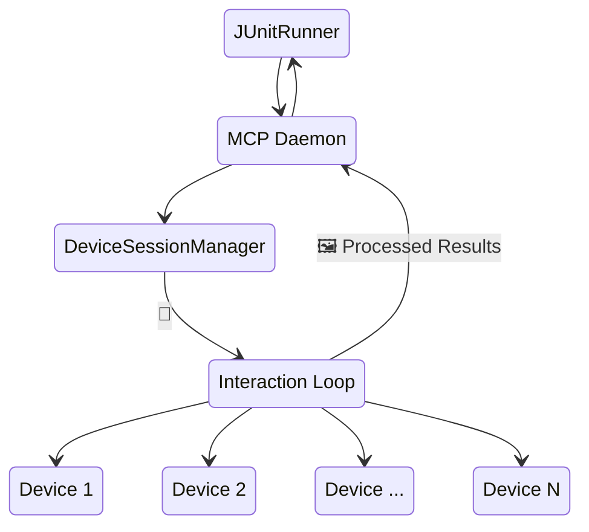

# Overview

Background daemon service for device pooling and parallel test execution.


The AutoMobile daemon:

1. Maintains a pool of available devices specifically for running tests
2. Allocates devices to test sessions on demand
3. Tracks test execution history and performance to automatically optimize test distribution
4. Provides session management APIs

## Architecture

With Android in mind, JUnitRunner is able to use the MCP Daemon to orchestrate and control N-number devices under test. Since the Daemon is simply a long lived node process with all the same capabilies as the MCP server it is able to handle and reproduce the same interactions it took when an AI Agent was driving it. This architecture also enables multi-device features like [critical section](critical-section.md).



## Socket Communication

The daemon listens on a Unix socket at:
```
/tmp/auto-mobile-daemon-<uid>.sock
```

## Socket Methods

### `listDevices`
List connected devices; when the daemon is active, responses include `poolStatus` with pool counts.

Daemon management operations are available via the unix socket interface:

### `daemon/availableDevices`
Query available devices in the pool.

### `daemon/refreshDevices`
Refresh the device pool by discovering connected devices.

### `daemon/sessionInfo`
Get information about an active session.

### `daemon/releaseSession`
Release a session and return device to pool.

## Implementation

The daemon is implemented in the main AutoMobile MCP server and can run:

- **Standalone** - As a background service
- **Embedded** - Within the MCP server process
- **CI Mode** - Temporary pools for CI environments

See [MCP Server](index.md) for integration details.
