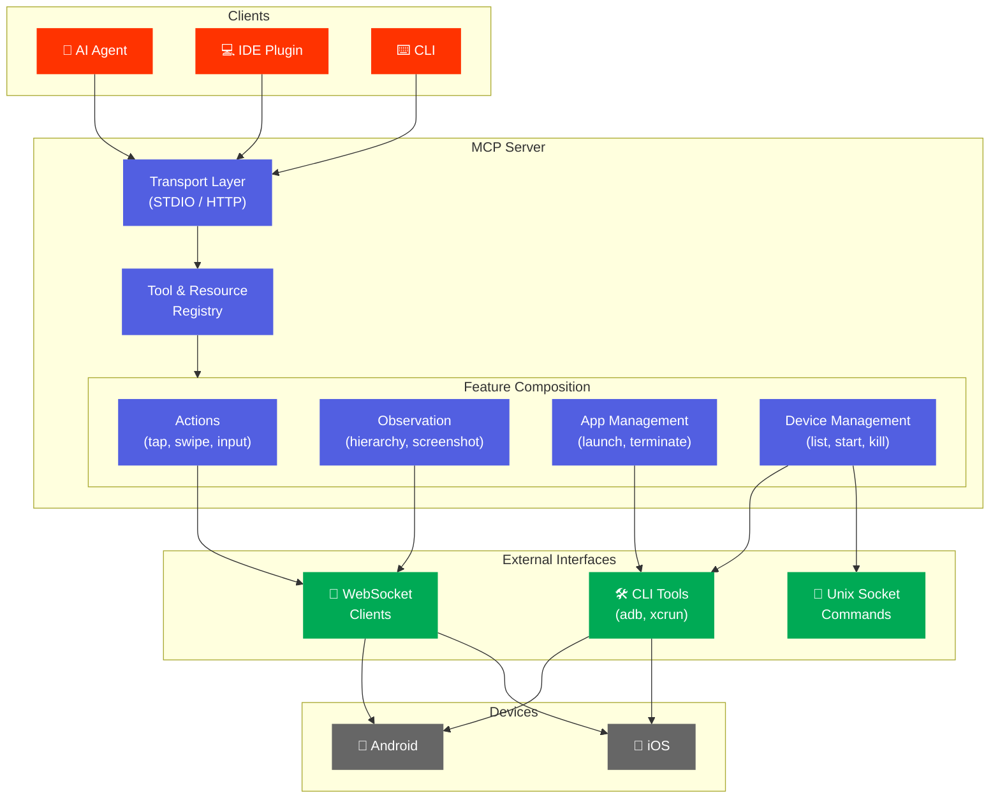

# MCP Server

The MCP server exposes AutoMobile's capabilities as tool calls, resources, and real-time observations.

AutoMobile's MCP makes its various [actions](tools.md) available as tool calls and automatically performs
[observations](observe/index.md) within an [interaction loop](interaction-loop.md).



## Core Capabilities

| Area | Documentation |
|------|---------------|
| **Actions** | [Tool calls](tools.md) for taps, swipes, input, app management |
| **Observation** | [Real-time UI capture](observe/index.md) with view hierarchy |
| **Interaction Loop** | [Observe-act-observe](interaction-loop.md) cycle with idle detection |
| **Resources** | [Device state](resources.md) exposed via MCP resources |

## Additional Features

| Feature | Description |
|---------|-------------|
| [Video Recording](observe/video-recording.md) | Low-overhead capture for CI artifacts |
| [Visual Highlighting](observe/visual-highlighting.md) | Debug overlays for element targeting |
| [Navigation Graph](nav/index.md) | Automatic screen flow mapping |
| [Feature Flags](feature-flags.md) | Runtime configuration |
| [Migrations](storage/migrations.md) | Database schema management |

## Quick Start

```bash
npx -y @kaeawc/auto-mobile@latest
```

For MCP client configuration:

```json
{
  "mcpServers": {
    "auto-mobile": {
      "command": "npx",
      "args": ["-y", "@kaeawc/auto-mobile@latest"]
    }
  }
}
```

## Transport Modes

| Mode | Use Case |
|------|----------|
| **STDIO** (default) | Workstations, CI automation |
| **Streamable HTTP** | Hot reload development, HTTP-only clients |

See [installation](../../install/overview.md) for detailed configuration options.
