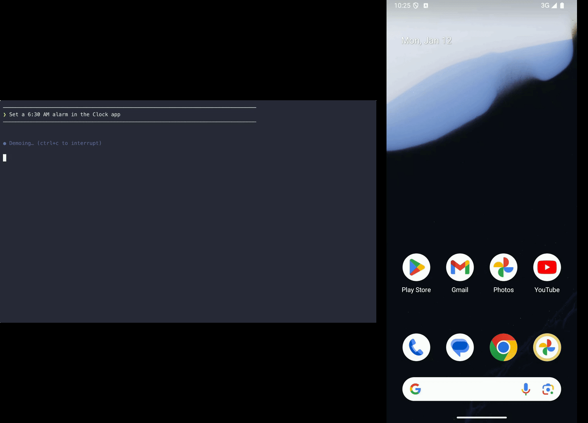
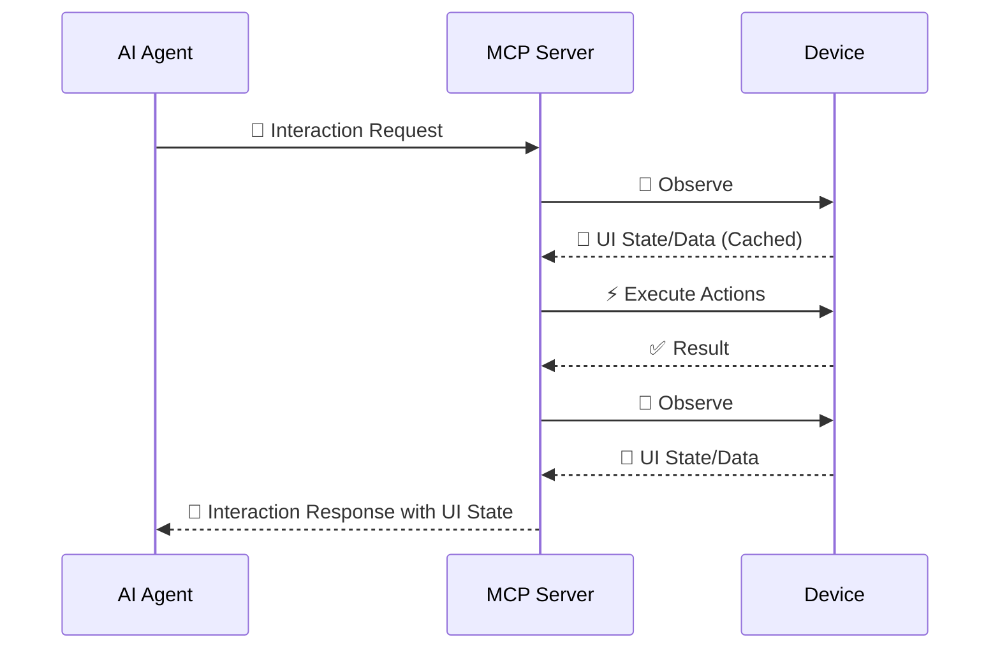

# Interaction Loop

This interaction loop is supported by comprehensive [observation](observe/index.md) of UI state and UI stability checks
(Android uses `dumpsys gfxinfo`-based idle detection) before and after action execution. Together, that allows for
accurate and precise exploration with the [action tool calls](tools.md).

