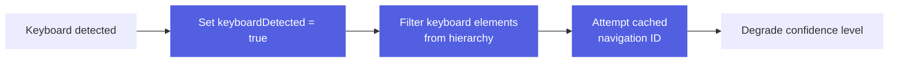

# Fingerprinting

## Screen Fingerprinting

Screen fingerprinting generates stable identifiers for UI screens that remain consistent despite dynamic content changes, scrolling, keyboard appearance, and user interactions.

This strategy is critical for reliably identifying screens and building accurate navigation graphs across diverse scenarios.

### Research Foundation

The implementation is based on extensive research testing multiple strategies across real-world scenarios:

- **4 screen types** tested (discover-tap, discover-swipe, discover-chat, discover-text)
- **11 observations** captured with varying states
- **6 strategies** evaluated
- **100% success rate** for non-keyboard scenarios achieved with shallow scrollable markers

The tiered strategy was validated across 4 screen types and 11 observations with a 100% success rate for non-keyboard scenarios.

---

### Tiered Fingerprinting Strategy

AutoMobile uses a tiered fallback approach with confidence levels:

#### Tier 1: Navigation Resource-ID (95% confidence)

**When**: SDK-instrumented apps with `navigation.*` resource-ids

**How**: Extract and hash the navigation resource-id

**Example**:
```typescript
// Hierarchy contains:
{ "resource-id": "navigation.HomeDestination" }

// Fingerprint:
{
  hash: "abc123...",
  method: "navigation-id",
  confidence: 95,
  navigationId: "navigation.HomeDestination"
}
```

**Advantages**:
- Perfect identifier for SDK apps
- Immune to content changes
- Very stable

**Limitations**:
- Only works with AutoMobile SDK
- Disappears when keyboard occludes app

---

#### Tier 2: Cached Navigation ID (85% confidence)

**When**: Keyboard detected + navigation ID was recently cached

**How**: Use cached navigation ID from previous observation (within TTL)

**Example**:
```typescript
// Before keyboard: navigation.TextScreen visible
// Keyboard appears: only keyboard elements visible
// Use cached navigation.TextScreen (within 10 second TTL)

compute(hierarchyWithKeyboard, {
  cachedNavigationId: "navigation.TextScreen",
  cachedNavigationIdTimestamp: previousTimestamp
})
```

**Advantages**:
- Handles keyboard occlusion gracefully
- Maintains high confidence
- Prevents false screen changes

**Limitations**:
- Requires temporal tracking
- Cache expires after TTL (default: 10 seconds)

---

#### Tier 3: Shallow Scrollable (75% confidence)

**When**: No navigation ID available, no keyboard detected

**How**: Enhanced hierarchy filtering with shallow scrollable markers

**Strategy**:
1. **Shallow Scrollable Markers**: Keep container metadata, drop all children
2. **Selected State Preservation**: Extract and preserve `selected="true"` items
3. **Dynamic Content Filtering**: Remove time, numbers, system UI
4. **Static Text Inclusion**: Keep labels and titles for differentiation

**Example**:
```json
// Before filtering:
{
  "scrollable": "true",
  "resource-id": "tab_row",
  "node": [
    { "selected": "true", "node": { "text": "Home" } },
    { "selected": "false", "node": { "text": "Profile" } },
    { "selected": "false", "node": { "text": "Settings" } }
  ]
}

// After filtering (shallow marker + selected):
{
  "_scrollable": true,
  "resource-id": "tab_row",
  "_selected": [
    { "selected": "true", "text": "Home" }
  ]
}
```

**Advantages**:
- Handles scrolling perfectly
- Prevents tab collision (different screens with same structure)
- Works for non-SDK apps
- Reduces noise from dynamic content

**Limitations**:
- Lower confidence than navigation ID
- May struggle with very similar screens

---

#### Tier 4: Shallow Scrollable + Keyboard (60% confidence)

**When**: Keyboard detected, no cached navigation ID, no current navigation ID

**How**: Same as Tier 3 but with keyboard element filtering

**Additional Filtering**:
- Remove nodes with keyboard indicators (Delete, Enter, emoji)
- Filter `keyboard` and `inputmethod` resource-ids

**Advantages**:
- Best effort for keyboard scenarios without cache
- Still provides reasonable differentiation

**Limitations**:
- Lowest confidence
- May miss subtle screen differences

---

### Key Features

#### 1. Shallow Scrollable Markers

**Problem**: Scrolling changes visible content completely

**Solution**: Keep container, drop children

```typescript
// Same screen, different scroll positions produce SAME fingerprint
Before scroll: button_regular, button_elevated, press_duration_tracker
After scroll:  filter_chip_1, icon_button_delete, slider_control

Both fingerprint to: hash(scrollable container metadata)
```

**Impact**: 100% success for scrolling scenarios

---

#### 2. Selected State Preservation

**Problem**: Different tabs/screens have same structure but different selected state

**Critical Fix**: Preserve selected items even in scrollable containers

**Example of Collision Prevention**:
```typescript
// Without selected state preservation - COLLISION
Home Screen:     scrollable tab_row → hash(container)
Settings Screen: scrollable tab_row → hash(container)
// Both get SAME fingerprint! ❌

// With selected state preservation - NO COLLISION
Home Screen:     scrollable + _selected: ["Home"]  → hash1
Settings Screen: scrollable + _selected: ["Settings"] → hash2
// Different fingerprints! ✅
```

**Impact**: Prevents false positives in tab-based navigation

---

#### 3. Keyboard Detection & Filtering

**Indicators**:
- `content-desc` containing: Delete, Enter, keyboard, emoji, Shift
- `resource-id` containing: keyboard, inputmethod

**Actions**:


**Impact**: Graceful handling of keyboard occlusion

---

#### 4. Editable Text Filtering

**Detection**:
- `className` contains EditText
- `text-entry-mode="true"`
- `editable="true"`
- `resource-id` contains: edit, input, text_field, search

**Action**: Omit text content from editable fields

**Rationale**: User input is dynamic and shouldn't affect screen identity

**Impact**: Same screen despite different user input

---

#### 5. Dynamic Content Filtering

**Time Patterns**: `8:55`, `8:55 AM`, `9:00 PM`
**Number Patterns**: `42`, `100`, `0`
**Percentage Patterns**: `45%`, `90%`

**System UI**:
- `com.android.systemui:id/*` resource-ids
- `android:id/*` resource-ids
- Battery/signal content-descriptions

**Impact**: Stable fingerprints despite constantly changing data

---

### Computing a Fingerprint

```typescript
import { ScreenFingerprint } from './features/navigation/ScreenFingerprint';

const result = ScreenFingerprint.compute(hierarchy, {
  cachedNavigationId: previousResult?.navigationId,
  cachedNavigationIdTimestamp: previousResult?.timestamp,
  cacheTTL: 10000 // optional, defaults to 10s
});

console.log(result.hash);        // SHA-256 fingerprint
console.log(result.confidence);  // 95, 85, 75, or 60
console.log(result.method);      // navigation-id, cached-navigation-id, etc.
console.log(result.keyboardDetected);
```

### Stateful Tracking Pattern

```typescript
class NavigationTracker {
  private lastFingerprint: FingerprintResult | null = null;

  async onHierarchyChange(hierarchy: AccessibilityHierarchy) {
    // Compute with cache
    const fingerprint = ScreenFingerprint.compute(hierarchy, {
      cachedNavigationId: this.lastFingerprint?.navigationId,
      cachedNavigationIdTimestamp: this.lastFingerprint?.timestamp,
    });

    // Check if screen changed
    if (!this.lastFingerprint || fingerprint.hash !== this.lastFingerprint.hash) {
      console.log('Screen changed!');
      this.onScreenChange(fingerprint);
    }

    // Cache for next observation
    if (fingerprint.navigationId) {
      this.lastFingerprint = fingerprint;
    }
  }
}
```
