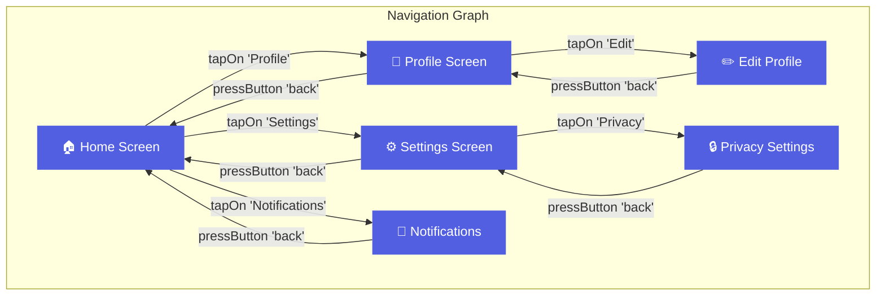

# Overview

As AutoMobile explores an app it automatically maps what it observes into a [navigation graph](graph-structure.md).

Upon every observation after a screen has reached UI stability:

1. Create unique screen signature by [fingerprinting the observation](fingerprinting.md) paired with AutoMobile SDK navigation events
2. Compare current vs previous screen
3. If we're on a different unique navigation fingerprint, record the tool call as the edge in the graph.

This process has been [benchmarked to take at most 1ms](performance.md) and it is a project goal to keep it within the limit. The graph is [persisted](../storage/index.md) as exploration takes place whether by the user or AI. As its built you can take advantage of it:

### Navigate to Screen

The `navigateTo` tool uses the graph to find paths:

1. Finds target screen in graph
2. Calculates shortest path from current node to the target
3. Executes recorded actions to reach target
4. Verifies arrival at destination

### Explore Efficiently

The `explore` tool uses the graph to:

- Avoid revisiting known screens
- Prioritize unexplored branches
- Track coverage of app features

Read more about [how to use the `explore` tool's various modes](explore.md)

## Edge Cases & Limitations

#### Known Limitations

1. **Multiple similar screens without navigation IDs**
   - Risk: May produce same fingerprint
   - Mitigation: Include static text for differentiation

2. **Cache expiration during long keyboard sessions**
   - Risk: Lost navigation ID reference
   - Mitigation: Adjust cacheTTL based on use case

3. **Screens with identical structure and no selected state**
   - Risk: Cannot differentiate
   - Mitigation: Encourage SDK integration for perfect identification

#### Handled Edge Cases

- ✅ Nested scrollable containers
- ✅ Scrollable tab rows (critical fix)
- ✅ Keyboard show/hide transitions
- ✅ Empty hierarchies
- ✅ Deeply nested structures

---

## Best Practices

#### For SDK-Instrumented Apps

✅ **Do**:
- Use unique navigation resource-ids for each screen
- Follow `navigation.*` naming convention
- Ensure navigation IDs persist during keyboard

✅ **Consider**:
- Add navigation IDs even to modal/overlay screens
- Use descriptive names: `navigation.ProfileEditScreen`

#### For Non-SDK Apps

✅ **Do**:
- Rely on Tier 3 shallow scrollable strategy
- Ensure screens have distinguishing static text or selected states
- Test fingerprinting across different app states

⚠️ **Watch for**:
- Screens with identical layout but different data
- Heavy use of dynamic content without static labels

#### For All Apps

✅ **Do**:
- Cache previous fingerprint results for stateful tracking
- Monitor confidence levels
- Log fingerprint method for debugging

❌ **Don't**:
- Assume 100% accuracy without navigation IDs
- Ignore confidence levels in decision-making
- Skip validation on critical navigation paths
