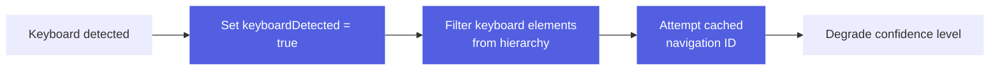

# Navigation Graph

Automatic mapping of app screen flows and navigation patterns.


The navigation graph captures:

- **Screens**: Unique UI states identified by activity/view hierarchy
- **Transitions**: Navigation between screens
- **Triggers**: Actions that cause navigation
- **History**: Sequence of screens visited

## Graph Structure

### Nodes (Screens)

Each screen is identified by:
```typescript
{
  screenId: string,        // Unique identifier
  activity: string,        // Android activity name
  title: string,           // Screen title/label
  signature: string,       // View hierarchy fingerprint
  timestamp: number        // First seen time
}
```

### Edges (Transitions)

Transitions record navigation:
```typescript
{
  from: string,           // Source screen ID
  to: string,             // Destination screen ID
  trigger: {
    action: string,       // "tap", "swipe", etc.
    element: string,      // Element that triggered transition
    text: string          // Element text/description
  },
  count: number,          // Times this transition occurred
  avgDuration: number     // Average transition time
}
```

## Building the Graph

### Automatic Discovery

As AutoMobile explores an app:
1. **Observe screen** - Capture view hierarchy and activity
2. **Generate fingerprint** - Create unique screen signature
3. **Detect transition** - Compare current vs previous screen
4. **Record edge** - Store trigger action and timing

### Navigation Detection

Transitions are detected by:

- Activity/fragment changes (Android)
- View controller changes (iOS)
- Significant UI hierarchy changes
- Window focus changes

## Using the Graph

### Navigate to Screen

The `navigateTo` tool uses the graph to find paths:

```typescript
await navigateTo({
  targetScreen: "Settings",
  platform: "android"
})
```

AutoMobile:
1. Finds target screen in graph
2. Calculates shortest path from current screen
3. Executes recorded actions to reach target
4. Verifies arrival at destination

### Explore Efficiently

The `explore` tool uses the graph to:

- Avoid revisiting known screens
- Prioritize unexplored branches
- Track coverage of app features

## Exploration Modes

The `explore` tool supports three modes for different use cases:

### Discovery Mode (`mode: "discover"`)

**Purpose**: Build the navigation graph from scratch by discovering new screens and transitions.

**Behavior**:
- Heavily favors novel elements and unexplored areas
- Prioritizes coverage over validation
- Records new screens and transitions as they're discovered
- Best for initial app exploration

### Validate Mode (`mode: "validate"`)

**Purpose**: Navigate through a known navigation graph to verify it matches current app behavior.

**Behavior**:
- Requires an existing navigation graph
- Systematically traverses all known edges in the graph
- Validates that each navigation transition still works as recorded
- Fails with detailed error if app diverges from known graph
- Records edge validation results (success/failure, confidence scores)
- Provides graph traversal metrics (edges traversed, nodes visited, coverage %)

**Use Cases**:
- **Regression Testing**: Verify navigation paths still work after code changes
- **State Verification**: Navigate to specific screens to verify UI/functionality
- **Performance Testing**: Measure navigation performance across known routes
- **Graph Quality Assessment**: Validate graph accuracy and identify stale edges

**Validation Results**:
```typescript
{
  graphTraversal: {
    nodesVisited: number,
    totalNodes: number,
    edgesTraversed: number,
    totalEdges: number,
    edgeValidationResults: EdgeValidationResult[],
    coveragePercentage: number
  }
}
```

**Edge Validation**:
Each edge traversal records:
- Success/failure of the navigation
- Expected vs actual destination
- Element matching confidence
- Error details if validation failed

### Hybrid Mode (`mode: "hybrid"`)

**Purpose**: Balance between discovery and validation.

**Behavior**:
- Uses known graph when available but allows discovery
- Balances navigation score, novelty, and coverage equally
- Suitable for general exploration of partially-known apps

## Graph Persistence

The navigation graph is:

- Built incrementally during exploration
- Stored in memory during MCP session
- Available via MCP resources
- Can be exported for analysis

## MCP Tools

### `navigateTo`
Navigate to a specific screen using learned paths.

### `getNavigationGraph`
Retrieve the current navigation graph for debugging.

### `explore`
Automatically explore the app and build the graph.

## Rendering

The navigation graph can be visualized in:

- **IDE Plugin** - Real-time graph rendering in Android Studio
- **Export** - GraphViz DOT format for external visualization
- **MCP Resource** - JSON format for AI agent analysis

See [IDE Plugin](../plat/android/ide-plugin/overview.md) for graph visualization.

## Implementation Details

The navigation graph is built using:

- UI idle detection (gfxinfo-based)
- Screen fingerprinting (view hierarchy hashing)
- Transition timing (performance tracking)
- Action recording (interaction history)

See [Interaction Loop](interaction-loop.md) for integration.

---

## Screen Fingerprinting

Screen fingerprinting generates stable identifiers for UI screens that remain consistent despite dynamic content changes, scrolling, keyboard appearance, and user interactions.

This strategy is critical for reliably identifying screens and building accurate navigation graphs across diverse scenarios.

### Research Foundation

The implementation is based on extensive research testing multiple strategies across real-world scenarios:

- **4 screen types** tested (discover-tap, discover-swipe, discover-chat, discover-text)
- **11 observations** captured with varying states
- **6 strategies** evaluated
- **100% success rate** for non-keyboard scenarios achieved with shallow scrollable markers

Research findings documented in:
- `scratch/UPDATED_FINDINGS.md` - Final strategy and results
- `scratch/FINDINGS.md` - Initial research and strategy comparison
- `scratch/SCROLLABLE_TABS_FINDINGS.md` - Critical scrollable tabs discovery

---

### Tiered Fingerprinting Strategy

AutoMobile uses a tiered fallback approach with confidence levels:

#### Tier 1: Navigation Resource-ID (95% confidence)

**When**: SDK-instrumented apps with `navigation.*` resource-ids

**How**: Extract and hash the navigation resource-id

**Example**:
```typescript
// Hierarchy contains:
{ "resource-id": "navigation.HomeDestination" }

// Fingerprint:
{
  hash: "abc123...",
  method: "navigation-id",
  confidence: 95,
  navigationId: "navigation.HomeDestination"
}
```

**Advantages**:
- Perfect identifier for SDK apps
- Immune to content changes
- Very stable

**Limitations**:
- Only works with AutoMobile SDK
- Disappears when keyboard occludes app

---

#### Tier 2: Cached Navigation ID (85% confidence)

**When**: Keyboard detected + navigation ID was recently cached

**How**: Use cached navigation ID from previous observation (within TTL)

**Example**:
```typescript
// Before keyboard: navigation.TextScreen visible
// Keyboard appears: only keyboard elements visible
// Use cached navigation.TextScreen (within 10 second TTL)

compute(hierarchyWithKeyboard, {
  cachedNavigationId: "navigation.TextScreen",
  cachedNavigationIdTimestamp: previousTimestamp
})
```

**Advantages**:
- Handles keyboard occlusion gracefully
- Maintains high confidence
- Prevents false screen changes

**Limitations**:
- Requires temporal tracking
- Cache expires after TTL (default: 10 seconds)

---

#### Tier 3: Shallow Scrollable (75% confidence)

**When**: No navigation ID available, no keyboard detected

**How**: Enhanced hierarchy filtering with shallow scrollable markers

**Strategy**:
1. **Shallow Scrollable Markers**: Keep container metadata, drop all children
2. **Selected State Preservation**: Extract and preserve `selected="true"` items
3. **Dynamic Content Filtering**: Remove time, numbers, system UI
4. **Static Text Inclusion**: Keep labels and titles for differentiation

**Example**:
```json
// Before filtering:
{
  "scrollable": "true",
  "resource-id": "tab_row",
  "node": [
    { "selected": "true", "node": { "text": "Home" } },
    { "selected": "false", "node": { "text": "Profile" } },
    { "selected": "false", "node": { "text": "Settings" } }
  ]
}

// After filtering (shallow marker + selected):
{
  "_scrollable": true,
  "resource-id": "tab_row",
  "_selected": [
    { "selected": "true", "text": "Home" }
  ]
}
```

**Advantages**:
- Handles scrolling perfectly
- Prevents tab collision (different screens with same structure)
- Works for non-SDK apps
- Reduces noise from dynamic content

**Limitations**:
- Lower confidence than navigation ID
- May struggle with very similar screens

---

#### Tier 4: Shallow Scrollable + Keyboard (60% confidence)

**When**: Keyboard detected, no cached navigation ID, no current navigation ID

**How**: Same as Tier 3 but with keyboard element filtering

**Additional Filtering**:
- Remove nodes with keyboard indicators (Delete, Enter, emoji)
- Filter `keyboard` and `inputmethod` resource-ids

**Advantages**:
- Best effort for keyboard scenarios without cache
- Still provides reasonable differentiation

**Limitations**:
- Lowest confidence
- May miss subtle screen differences

---

### Key Features

#### 1. Shallow Scrollable Markers

**Problem**: Scrolling changes visible content completely

**Solution**: Keep container, drop children

```typescript
// Same screen, different scroll positions produce SAME fingerprint
Before scroll: button_regular, button_elevated, press_duration_tracker
After scroll:  filter_chip_1, icon_button_delete, slider_control

Both fingerprint to: hash(scrollable container metadata)
```

**Impact**: 100% success for scrolling scenarios

---

#### 2. Selected State Preservation

**Problem**: Different tabs/screens have same structure but different selected state

**Critical Fix**: Preserve selected items even in scrollable containers

**Example of Collision Prevention**:
```typescript
// Without selected state preservation - COLLISION
Home Screen:     scrollable tab_row → hash(container)
Settings Screen: scrollable tab_row → hash(container)
// Both get SAME fingerprint! ❌

// With selected state preservation - NO COLLISION
Home Screen:     scrollable + _selected: ["Home"]  → hash1
Settings Screen: scrollable + _selected: ["Settings"] → hash2
// Different fingerprints! ✅
```

**Impact**: Prevents false positives in tab-based navigation

---

#### 3. Keyboard Detection & Filtering

**Indicators**:
- `content-desc` containing: Delete, Enter, keyboard, emoji, Shift
- `resource-id` containing: keyboard, inputmethod

**Actions**:


**Impact**: Graceful handling of keyboard occlusion

---

#### 4. Editable Text Filtering

**Detection**:
- `className` contains EditText
- `text-entry-mode="true"`
- `editable="true"`
- `resource-id` contains: edit, input, text_field, search

**Action**: Omit text content from editable fields

**Rationale**: User input is dynamic and shouldn't affect screen identity

**Impact**: Same screen despite different user input

---

#### 5. Dynamic Content Filtering

**Time Patterns**: `8:55`, `8:55 AM`, `9:00 PM`
**Number Patterns**: `42`, `100`, `0`
**Percentage Patterns**: `45%`, `90%`

**System UI**:
- `com.android.systemui:id/*` resource-ids
- `android:id/*` resource-ids
- Battery/signal content-descriptions

**Impact**: Stable fingerprints despite constantly changing data

---

### Computing a Fingerprint

```typescript
import { ScreenFingerprint } from './features/navigation/ScreenFingerprint';

const result = ScreenFingerprint.compute(hierarchy, {
  cachedNavigationId: previousResult?.navigationId,
  cachedNavigationIdTimestamp: previousResult?.timestamp,
  cacheTTL: 10000 // optional, defaults to 10s
});

console.log(result.hash);        // SHA-256 fingerprint
console.log(result.confidence);  // 95, 85, 75, or 60
console.log(result.method);      // navigation-id, cached-navigation-id, etc.
console.log(result.keyboardDetected);
```

### Stateful Tracking Pattern

```typescript
class NavigationTracker {
  private lastFingerprint: FingerprintResult | null = null;

  async onHierarchyChange(hierarchy: AccessibilityHierarchy) {
    // Compute with cache
    const fingerprint = ScreenFingerprint.compute(hierarchy, {
      cachedNavigationId: this.lastFingerprint?.navigationId,
      cachedNavigationIdTimestamp: this.lastFingerprint?.timestamp,
    });

    // Check if screen changed
    if (!this.lastFingerprint || fingerprint.hash !== this.lastFingerprint.hash) {
      console.log('Screen changed!');
      this.onScreenChange(fingerprint);
    }

    // Cache for next observation
    if (fingerprint.navigationId) {
      this.lastFingerprint = fingerprint;
    }
  }
}
```

---

### Performance

#### Hierarchy Size Reduction

| Screen | Original | Filtered | Reduction |
|--------|----------|----------|-----------|
| discover-tap | 27-33 KB | ~15 KB | **~50%** |
| discover-text | 1.8-23 KB | ~8 KB | Variable |

#### Computation Speed

- **Navigation ID**: ~1ms (simple extraction + hash)
- **Shallow Scrollable**: ~5-10ms (filtering + hash)
- **Cached ID**: ~1ms (no hierarchy processing)

---

### Success Rates by Scenario

| Scenario | Strategy | Success Rate | Notes |
|----------|----------|--------------|-------|
| SDK app, no keyboard | Navigation ID | **100%** | Perfect identifier |
| SDK app, with keyboard | Cached Nav ID | **100%** | Keyboard occlusion handled |
| Scrolling content | Shallow Scrollable | **100%** | Container stays stable |
| Tab navigation | Shallow Scrollable | **100%** | Selected state preserved |
| Non-SDK app | Shallow Scrollable | **75-85%** | Depends on hierarchy distinctiveness |

#### Overall Performance

- **Non-keyboard scenarios**: 100% success (3/3 screens)
- **Keyboard scenarios**: Depends on cache availability
- **No false positives**: Collision prevention through selected state

---

### Edge Cases & Limitations

#### Known Limitations

1. **Multiple similar screens without navigation IDs**
   - Risk: May produce same fingerprint
   - Mitigation: Include static text for differentiation

2. **Cache expiration during long keyboard sessions**
   - Risk: Lost navigation ID reference
   - Mitigation: Adjust cacheTTL based on use case

3. **Screens with identical structure and no selected state**
   - Risk: Cannot differentiate
   - Mitigation: Encourage SDK integration for perfect identification

#### Handled Edge Cases

- ✅ Nested scrollable containers
- ✅ Scrollable tab rows (critical fix)
- ✅ Keyboard show/hide transitions
- ✅ Empty hierarchies
- ✅ Deeply nested structures

---

### Best Practices

#### For SDK-Instrumented Apps

✅ **Do**:
- Use unique navigation resource-ids for each screen
- Follow `navigation.*` naming convention
- Ensure navigation IDs persist during keyboard

✅ **Consider**:
- Add navigation IDs even to modal/overlay screens
- Use descriptive names: `navigation.ProfileEditScreen`

#### For Non-SDK Apps

✅ **Do**:
- Rely on Tier 3 shallow scrollable strategy
- Ensure screens have distinguishing static text or selected states
- Test fingerprinting across different app states

⚠️ **Watch for**:
- Screens with identical layout but different data
- Heavy use of dynamic content without static labels

#### For All Apps

✅ **Do**:
- Cache previous fingerprint results for stateful tracking
- Monitor confidence levels
- Log fingerprint method for debugging

❌ **Don't**:
- Assume 100% accuracy without navigation IDs
- Ignore confidence levels in decision-making
- Skip validation on critical navigation paths

---

### Debugging

#### Logging

Enable debug logging to see fingerprinting decisions:

```typescript
import { logger } from './utils/logger';

// Logs will show:
// [FINGERPRINT] Using navigation ID: navigation.Home
// [FINGERPRINT] Using cached navigation ID (keyboard detected): navigation.Text
// [FINGERPRINT] Using shallow-scrollable: 42 elements, keyboard=false
```

#### Common Issues

**Issue**: Different fingerprints for same screen

**Diagnosis**:
- Check if navigation ID is missing
- Verify selected states are preserved
- Look for unstable dynamic content

**Solution**:
- Add navigation resource-ids (SDK)
- Ensure static text differentiation (non-SDK)
- Check filter rules aren't too aggressive

---

**Issue**: Same fingerprint for different screens

**Diagnosis**:
- Screens likely have identical structure
- Missing distinguishing features (text, selected state)

**Solution**:
- Add navigation resource-ids
- Include unique static text on each screen
- Use selected state for tab differentiation

---

### Future Enhancements

#### Potential Improvements

1. **Activity name correlation**
   - Use Android activity name as additional signal
   - Combine with package for stronger identity

2. **Machine learning fingerprinting**
   - Train model on screen similarity
   - Adaptive confidence scoring

3. **Visual fingerprinting fallback**
   - Use screenshot hashing for highly dynamic screens
   - Combine with hierarchy fingerprinting

4. **Expanded cache strategies**
   - Multiple cache entries for different states
   - Probabilistic cache matching

---

### Acknowledgments

This strategy was developed through rigorous experimentation with:
- 11 real observations across 4 screen types
- 6 different fingerprinting strategies tested
- Multiple rounds of refinement based on collision detection

Key insights:
- Shallow scrollable markers breakthrough (100% scrolling success)
- Selected state preservation (prevents tab collision)
- Keyboard detection and cached ID (handles occlusion)

---

**Last Updated**: 2026-01-13
**Implementation**: `src/features/navigation/ScreenFingerprint.ts`
**Tests**: `test/features/navigation/ScreenFingerprint.test.ts`
