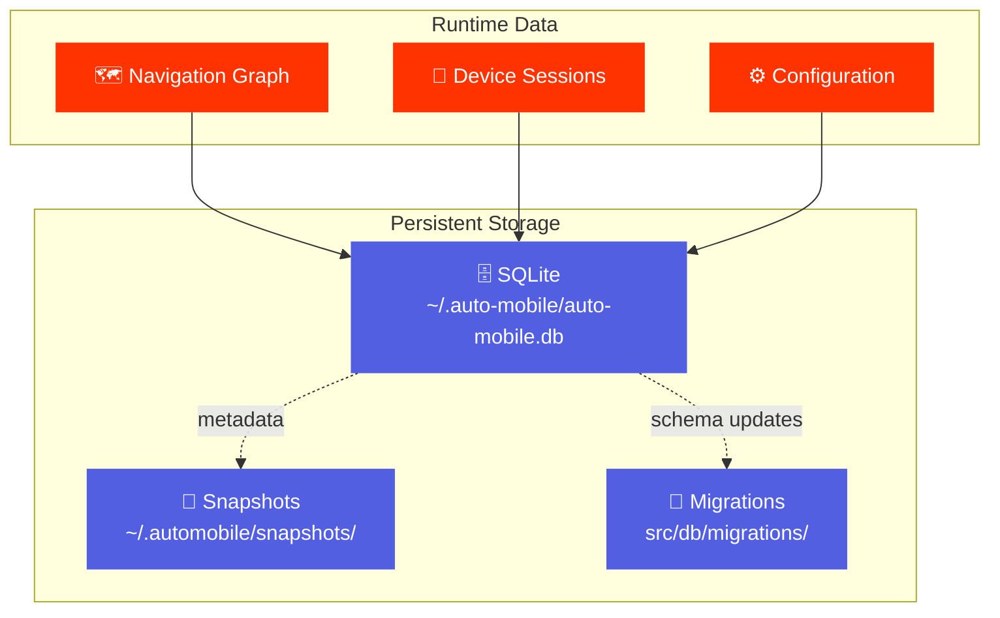

# Overview

AutoMobile persists state across sessions using SQLite for metadata and the filesystem for larger payloads.

## Storage Locations

| Path | Purpose |
|------|---------|
| `~/.auto-mobile/auto-mobile.db` | SQLite database for metadata |
| `~/.automobile/snapshots/` | Device state snapshot payloads |
| `~/.auto-mobile/*.sock` | Unix sockets for configuration |

## Topics

| Document | Description |
|----------|-------------|
| [Database Migrations](migrations.md) | Schema management with Kysely |
| [Device Snapshots](snapshots.md) | Capture and restore device state |

## Database Schema

The SQLite database stores:

- **Navigation graph** - Screens, edges, and fingerprints
- **Device sessions** - Active device connections
- **Snapshot metadata** - Index of captured snapshots
- **Configuration** - Feature flags and settings

## Migration System

Migrations run automatically on server startup:

See [Database Migrations](migrations.md) for details on adding new migrations.

## Snapshot Storage

Device snapshots use a hybrid approach:

| Snapshot Type | Metadata | Payload |
|---------------|----------|---------|
| VM Snapshot | SQLite | Emulator AVD directory |
| ADB Snapshot | SQLite | `~/.automobile/snapshots/` |

See [Device Snapshots](snapshots.md) for capture/restore workflows.
