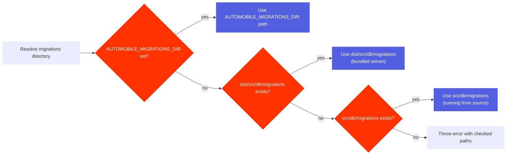

# Migrations

AutoMobile uses SQLite migrations to keep the MCP server schema up to date across releases.
Migrations run on server startup and are managed with Kysely's `Migrator` + `FileMigrationProvider`.

## Layout

- Source migrations live in `src/db/migrations` as TypeScript files.
- Build output copies them to `dist/src/db/migrations` so the runtime can load them from disk.

## Resolution rules

The migration directory is resolved in this order:

If no folder is found, the server throws an error describing the checked paths.

## Docker notes

The Docker image runs the bundled server from `dist/src/index.js`, so migrations must be present
in `dist/src/db/migrations`. The build pipeline copies migrations into `dist` to satisfy this.

## Related code

- `src/db/migrator.ts` resolves the migration folder and runs migrations.
- `build.ts` copies migrations into `dist` during `bun run build`.
