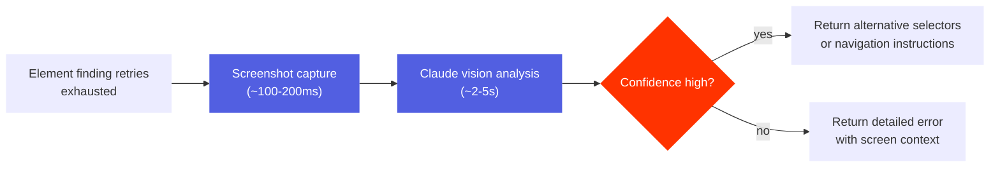

# Vision Fallback for Element Detection

Vision fallback uses Claude's vision API to help locate UI elements when traditional element finding methods fail.

## Current Implementation

### Status

Vision fallback is an **internal feature** that is:

- **Disabled by default** to avoid unexpected API costs
- Only available when constructing `TapOnElement` with custom vision configuration
- Not exposed via MCP server or CLI by default
- Currently integrated into `tapOn` only (invoked after polling times out)
- Android screenshots only (iOS not yet implemented)

### How It Works

When element finding fails after retries, `TapOnElement` follows this flow:



### Configuration

```typescript
const tapTool = new TapOnElement(
  device,
  adb,
  axe,
  webdriver,
  {
    enabled: true,              // Enable vision fallback
    provider: 'claude',         // Only Claude supported currently
    confidenceThreshold: 'high', // Reserved for future gating
    maxCostUsd: 1.0,            // Warning threshold (does not block)
    cacheResults: true,         // Cache to avoid repeated calls
    cacheTtlMinutes: 60         // Cache for 60 minutes
  }
);
```

**Note**: MCP server constructs `TapOnElement` with default config (enabled: false), so vision fallback is not available through MCP unless you modify the server code.

### Example Scenarios

**Element Text Changed**:
```
Input: tapOn({ text: "Login" })

Traditional Error:
Element not found with provided text 'Login'

With Vision Fallback:
Element not found. AI suggests trying:
- text: "Sign In" (Text label changed from 'Login' to 'Sign In')
(Cost: $0.0234, Confidence: high)
```

**Element Requires Navigation**:
```
Input: tapOn({ text: "Advanced Settings" })

With Vision Fallback:
Element not found, but AI suggests these steps:
1. Scroll down in the settings menu to reveal more options
2. Look for "Advanced Settings" in the newly visible section
(Cost: $0.0312, Confidence: high)
```

**Element Doesn't Exist**:
```
Input: tapOn({ text: "Nonexistent Button" })

With Vision Fallback:
Element not found. The current screen shows a login form with
'Username', 'Password', and 'Sign In' elements. The requested
'Nonexistent Button' is not visible on this screen.
(Cost: $0.0198, Confidence: high)
```

### Cost and Performance

**Typical costs per failed search**:
- Input tokens: Screenshot + view hierarchy + prompt (~5,000-10,000 tokens)
- Output tokens: Analysis response (~500-1,000 tokens)
- **Cost**: $0.02-0.05 per vision fallback call

**Performance**:
- Screenshot capture: ~100-200ms
- Claude API call: ~2-5 seconds
- **Total**: ~2-5 seconds (only when traditional methods fail)

**Caching**:
- Cache key: Screenshot path + search criteria (text/resourceId)
- TTL: 60 minutes (configurable)
- Benefit: Instant response for repeated failures

### API Key Setup

Vision fallback requires an Anthropic API key:

```bash
export ANTHROPIC_API_KEY=sk-ant-xxxxx
```

Get an API key at: https://console.anthropic.com/

### Limitations

**Current Limitations**:
1. **tapOn only**: Not integrated into other tools (swipeOn, scrollUntil, etc.)
2. **Android only**: iOS screenshot capture not implemented
3. **No auto-retry**: Suggestions are informational - user must manually retry with suggested selectors
4. **Not in MCP**: Requires custom TapOnElement construction, not available via MCP server by default

**When Vision Fallback Won't Help**:
- Element truly doesn't exist on screen
- Screenshot quality is poor
- Custom/non-standard UI elements
- Dynamic content that changes rapidly

## Proposed Future Architecture

The following hybrid vision approach is **not implemented** - it is a design proposal for future enhancement.

### Design Principles

1. **Last Resort**: Only activate after all existing fallback mechanisms exhausted
2. **Cost Conscious**: Prefer local models (80% cases), escalate to Claude only when needed
3. **High Confidence**: Only suggest navigation steps when confidence is high
4. **Transparent**: Clear error messages when fallback cannot help
5. **Fast & Offline**: Local models provide <500ms responses without internet

### Proposed Hybrid Approach

When implemented, add a **Tier 1** local model layer before Claude:

- **Tier 1**: Fast, free local models (Florence-2, PaddleOCR) for common cases (~80%)
  - OCR + object detection + element descriptions
  - <500ms response time, $0 cost
  - Handles text extraction and simple element matching

- **Tier 2**: Claude vision API for complex cases (~15%)
  - Advanced navigation and spatial reasoning
  - 2-5s response time, $0.02-0.05 cost
  - Optional Set-of-Mark preprocessing

**Expected Distribution**:
- 80% resolved by Tier 1 (local models find alternative selectors)
- 15% resolved by Tier 2 (Claude provides navigation)
- 5% genuine failures (element truly doesn't exist)

### Proposed Component Structure

```typescript
export interface VisionFallbackConfig {
  enabled: boolean;

  // Tier 1: Local models
  tier1: {
    enabled: boolean;
    models: Array<'florence2' | 'paddleocr'>;
    confidenceThreshold: number;  // 0-1
    timeoutMs: number;
  };

  // Tier 2: Claude vision API
  tier2: {
    enabled: boolean;
    useSoM: boolean;  // Set-of-Mark preprocessing
    confidenceThreshold: "high" | "medium" | "low";
    maxCostUsd: number;
  };

  cacheResults: boolean;
  cacheTtlMinutes: number;
}
```

### Local Model Integration

**Florence-2** for OCR + object detection:
- Extract all text with bounding boxes
- Detect UI elements (buttons, inputs, menus)
- Generate element descriptions
- ONNX runtime with CUDA/CPU execution

**PaddleOCR** as fallback:
- Deep text extraction for complex/multi-language cases
- Layout analysis (text, title, list, table, figure)
- Used when Florence-2 confidence < 0.7

### Future Enhancements

Planned improvements:

1. **Auto-retry**: Automatically retry with suggested selectors
2. **More tools**: Integrate into `swipeOn`, `scrollUntil`, etc.
3. **Set-of-Mark**: Enhanced spatial understanding with visual markers
4. **Learning**: Track corrections to improve suggestions over time
5. **Multi-screenshot analysis**: Compare before/after states
6. **Visual regression detection**: Alert when UI changed significantly

## See Also

- [MCP Actions](actions.md) - Tool implementation details
- [Feature Flags](feature-flags.md) - Runtime configuration
