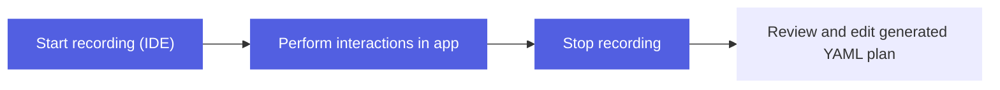

# Test Recording

The AutoMobile IDE Plugin includes test recording capabilities to capture user interactions and generate executable test plans.


Test recording allows developers to:

- **Record interactions** - Capture taps, swipes, and inputs as they interact with the app
- **Generate YAML plans** - Automatically create executable test plans from recordings
- **Replay tests** - Execute recorded plans via `executePlan` tool
- **Edit recordings** - Manually adjust generated plans before execution

## Recording Workflow

Recording control uses the test recording Unix socket (`~/.auto-mobile/test-recording.sock`)
so the IDE can start/stop capture without issuing MCP tool calls.



### Start Recording

From the IDE plugin tool window:
1. Ensure the AutoMobile server is running
2. Select the target device from the dropdown
3. Click "Start Recording" to begin capturing interactions

### Perform Interactions

Interact with your app normally:

- Tap buttons and UI elements
- Swipe and scroll through lists
- Enter text into fields
- Navigate between screens

The plugin captures each interaction and records:

- Element identifiers (resource ID, text, content description)
- Action type (tap, swipe, input)
- Screen context (current activity, view hierarchy signature)
- Timing information

### Stop Recording

Click "Stop Recording" when finished. The plugin will:

- Generate a YAML test plan from the recorded interactions
- Display the plan in the editor
- Validate the plan structure

### Review and Edit

The generated YAML plan can be edited before execution:

```yaml
steps:
  - tool: launchApp
    params:
      appId: com.example.app

  - tool: tapOn
    params:
      text: "Login"
      action: tap

  - tool: inputText
    params:
      text: "user@example.com"

  - tool: tapOn
    params:
      id: "loginButton"
      action: tap
```

## Executing Recorded Tests

### From IDE Plugin

Use the "Execute Plan" button in the tool window to run the recorded test:
1. Open the YAML plan file
2. Click "Execute Plan"
3. Monitor execution in the tool window

### From Code

Use the `executePlan` MCP tool directly:

```typescript
await executePlan({
  planContent: yamlPlanString,
  platform: "android",
  cleanupAppId: "com.example.app"
})
```

### From CI

Recorded plans can be executed in CI environments:

```bash
# Execute via MCP server
auto-mobile execute-plan --plan path/to/test.yaml --platform android
```

## Plan Structure

### Basic Format

```yaml
metadata:
  name: "Login flow test"
  description: "Tests user login with valid credentials"
  appId: com.example.app

steps:
  - tool: launchApp
    params:
      appId: com.example.app

  - tool: tapOn
    params:
      text: "Sign In"
      action: tap

  - tool: observe
    # Capture current screen state
```

### Advanced Features

**Conditional steps**:
```yaml
- tool: tapOn
  params:
    text: "Skip Tutorial"
    action: tap
  optional: true  # Don't fail if element not found
```

**Assertions**:
```yaml
- tool: observe
  assert:
    contains: "Welcome back"
```

**Wait conditions**:
```yaml
- tool: tapOn
  params:
    text: "Submit"
    action: tap
    await:
      element:
        text: "Success"
      timeout: 5000
```

## Test Organization

### File Structure

Organize recorded tests in your project:

```
tests/
  automobile/
    plans/
      onboarding/
        welcome-flow.yaml
        tutorial-skip.yaml
      login/
        successful-login.yaml
        invalid-credentials.yaml
      checkout/
        add-to-cart.yaml
        complete-purchase.yaml
```

### Naming Conventions

Use descriptive names for test plans:

- `feature-scenario.yaml` format
- Include happy path and error cases
- Group related tests in directories

## Best Practices

1. **Start with clean state** - Always launch app with `coldBoot` or `clearAppData` if needed
2. **Use stable identifiers** - Prefer resource IDs over text when possible
3. **Add assertions** - Include `observe` steps to verify expected state
4. **Handle waits** - Use `await` parameters for elements that load asynchronously
5. **Keep tests focused** - Each plan should test one specific flow
6. **Add cleanup** - Use `cleanupAppId` to terminate app after test

## Troubleshooting

### Recording not capturing interactions

- Ensure Accessibility Service is enabled
- Check MCP server connection in tool window
- Verify device is selected and connected

### Playback fails on elements not found

- Use `debugSearch` tool to understand element matching
- Add `optional: true` for non-critical steps
- Update selectors to use more stable identifiers

### Tests flaky across devices

- Add explicit waits with `await` parameters
- Check for device-specific UI differences
- Use feature flags to disable animations during testing

## See Also

- [MCP Actions](../../../mcp/tools.md) - Available MCP tools for test plans
- [IDE Plugin Overview](overview.md) - IDE plugin features and setup
- [UI Tests](../../../../using/ui-tests.md) - Writing and running UI tests
