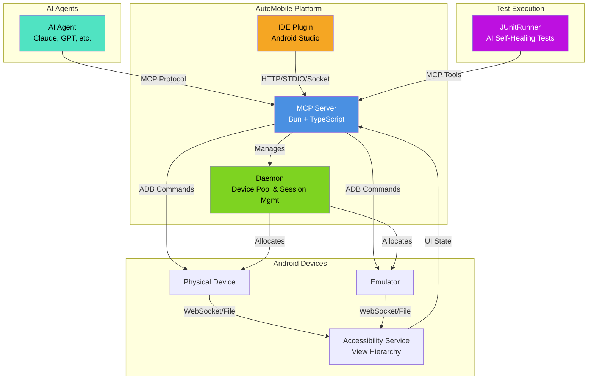

AutoMobile has a lot of custom tooling, libraries, and various communication protocols

#### MCP Server

automobile:modelcontextprotocol.io/introduction))
server. It has [observation](../../mcp/observation.md) built into its [interaction loop](../../mcp/interaction-loop.md)
that is fast. This is supported with UI stability checks (gfxinfo-based on Android) to determine idling. Together, that
allows for accurate and precise exploration that gets better as more capabilities and heuristics are added.

#### Test Execution

The Android JUnitRunner is responsible for executing AutoMobile tests on Android devices and emulators. It extends the
standard Android testing framework to provide enhanced capabilities including intelligent test execution, detailed
reporting, and integration with the MCP server's device management features. The runner is designed to eventually
support agentic self-healing capabilities, allowing tests to automatically adapt and recover from common failure
scenarios by leveraging AI-driven analysis of test failures and UI changes.

#### Pooled Device Management

Multi-device support with emulator control and app lifecycle management. As long as you have available adb connections,
AutoMobile can automatically track which one its using for which execution plan or MCP session. CI still needs available
device connections, but AutoMobile handles selection and readiness checks. During STDIO MCP sessions the tool call `setActiveDevice` will be done and kept for the duration of your session.

#### Android Accessibility Service

The Android Accessibility Service provides real-time access to view hierarchy data and user interface elements without
requiring device rooting or special permissions beyond accessibility service enablement. This service acts as a bridge
between the Android system's accessibility framework and AutoMobile's automation capabilities. When enabled, the
accessibility service continuously monitors UI changes and provides detailed information about view hierarchies. It
writes the latest hierarchy to app-private storage and can stream updates over WebSocket for AutoMobile to consume.

#### Batteries Included

AutoMobile comes with extensive functionality to minimize and streamline setup of required platform tools.

## Components 

#### MCP Server

The Model Context Protocol ([MCP](https://modelcontextprotocol.io/introduction)) server is the core component of AutoMobile, built with Bun and TypeScript using the
MCP TypeScript SDK. It serves as both a server for AI agents to interact with Android devices and a command-line
interface for direct usage. You can read more about its setup and system design in our [MCP server docs](../../mcp/index.md)
