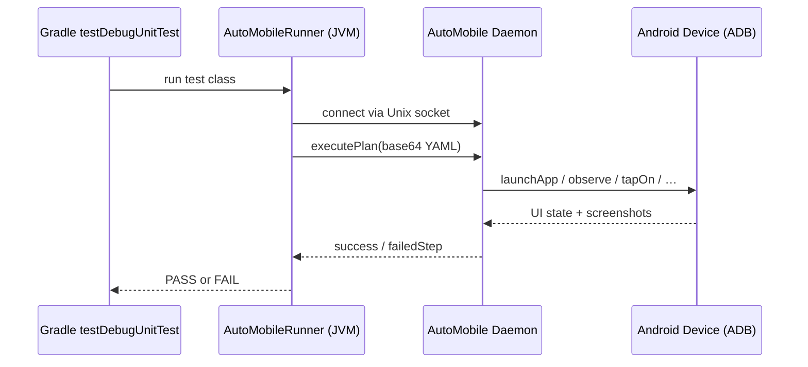

# JUnitRunner

<kbd>✅ Implemented</kbd> <kbd>🧪 Tested</kbd>

> **Current state:** `android/junit-runner/` is fully implemented. Includes `@AutoMobileTest` annotation,
> YAML plan execution via daemon socket, AI-assisted failure recovery, parallel multi-device execution,
> and historical timing-based test ordering. Published to Maven Central. See the
> [Status Glossary](../../../status-glossary.md) for chip definitions.

The AutoMobile JUnitRunner lets you write host-side JVM tests that drive a real Android device or
emulator over ADB. Tests execute as ordinary JUnit4 unit tests (`src/test/`), so they run in the
standard `testDebugUnitTest` Gradle task with no instrumented build required.

## How it works



Each test method references a YAML plan file in `src/test/resources/`. The runner encodes the plan
content and sends it to the AutoMobile daemon over a Unix domain socket. The daemon drives the device
step by step and returns a structured result. No special test APK is compiled; the device interaction
happens entirely through the daemon.

## Why not Espresso or UI Automator?

| | AutoMobile JUnitRunner | Espresso / UI Automator |
|---|---|---|
| **Runs as** | JVM unit test | Instrumented APK on device |
| **Build time** | No test APK compile | Full `assembleAndroidTest` pass |
| **Device needed at** | Test execution | Build time (lint) + execution |
| **Parallel devices** | Daemon-managed pool | One device per Gradle worker |
| **AI recovery** | Optional self-healing | Not available |
| **Test authoring** | YAML plans or AI prompt | Kotlin/Java code |

## Requirements

- JDK 11+
- Android SDK with `adb` on `PATH`
- A connected Android device or running emulator
- AutoMobile daemon running (`npm install -g @kaeawc/auto-mobile --ignore-scripts` then `auto-mobile --daemon-mode`)
- CtrlProxy accessibility service installed on the device (see [CtrlProxy](../control-proxy.md))

## Quick start

### 1. Add the dependency

=== "Version Catalog"
    ```toml
    # gradle/libs.versions.toml
    [versions]
    auto-mobile-junit-runner = "0.0.13"

    [libraries]
    auto-mobile-junit-runner = { module = "dev.jasonpearson.auto-mobile:auto-mobile-junit-runner", version.ref = "auto-mobile-junit-runner" }
    ```

    ```kotlin
    // app/build.gradle.kts
    dependencies {
        testImplementation(libs.auto.mobile.junit.runner)
    }
    ```

=== "Direct"
    ```kotlin
    // app/build.gradle.kts
    dependencies {
        testImplementation("dev.jasonpearson.auto-mobile:auto-mobile-junit-runner:0.0.13")
    }
    ```

### 2. Write a test

```kotlin
// app/src/test/java/com/example/AppLaunchTest.kt
package com.example

import dev.jasonpearson.automobile.junit.AutoMobileRunner
import dev.jasonpearson.automobile.junit.AutoMobileTest
import org.junit.Test
import org.junit.runner.RunWith

@RunWith(AutoMobileRunner::class)
class AppLaunchTest {

    @Test
    @AutoMobileTest(
        plan = "test-plans/launch-app.yaml",
        appId = "com.example.app",
        aiAssistance = false,
        timeoutMs = 60_000L,
    )
    fun `app launches without crashing`() {
        // AutoMobileRunner executes the YAML plan and fails the test if any step fails
    }
}
```

### 3. Write the plan

```yaml
# app/src/test/resources/test-plans/launch-app.yaml
---
name: launch-app
description: Launch the app and verify it opens without crashing
steps:
  - tool: launchApp
    appId: com.example.app
    clearAppData: true
    label: Launch the app with a clean state

  - tool: observe
    label: Verify the app UI renders without crashing

  - tool: terminateApp
    appId: com.example.app
    label: Terminate the app after test
```

### 4. Run

```bash
# Ensure the app is installed on a running emulator first
./gradlew assembleDebug
adb install -r app/build/outputs/apk/debug/app-debug.apk

# Start the daemon (if not already running)
auto-mobile --daemon-mode &

# Run the AutoMobile tests
./gradlew :app:testDebugUnitTest --tests 'com.example.*'
```

See [Project Setup → Running tests locally](project-setup.md#running-tests-locally) for the full
step-by-step walkthrough including daemon verification and CtrlProxy pre-installation.

## Pages in this section

| Page | What it covers |
|---|---|
| [Project Setup](project-setup.md) | Gradle config, version catalog, env vars, running locally |
| [Writing Tests](writing-tests.md) | `@AutoMobileTest` parameters, YAML plan reference, examples |
| [CI Integration](ci-integration.md) | GitHub Actions, emulator.wtf ADB session, CtrlProxy pre-install |

## Related

- [CtrlProxy (Accessibility Service)](../control-proxy.md) — Required for view hierarchy access
- [AutoMobile SDK](../auto-mobile-sdk.md) — In-process SDK for test helpers
- [MCP Tools reference](../../../mcp/tools.md) — Full list of tools available in YAML plans
- [Test Plan Validation](../../../mcp/test-plan-validation.md) — Schema validation details
