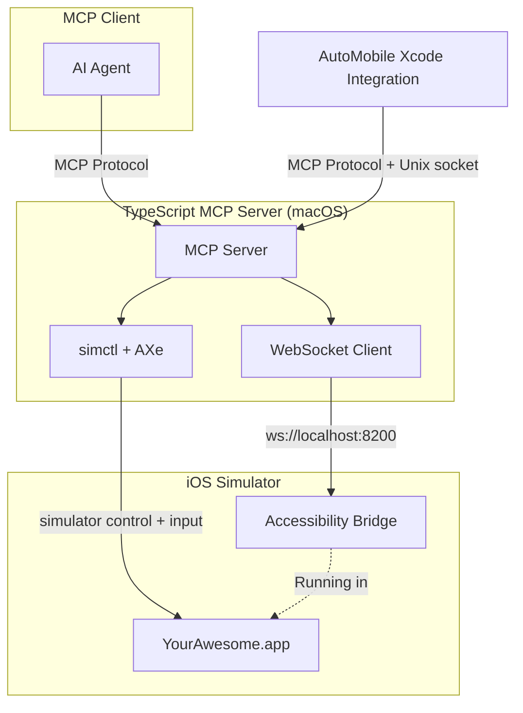

# iOS Platform Integration

AutoMobile iOS automation uses a hybrid architecture: a native iOS automation server for
observations and an [AXe](https://github.com/cameroncooke/AXe)-backed control layer for
simulator management and touch injection.

## Components

- [iOS automation server](accessibility-service.md) - WebSocket accessibility bridge.
- [AXe automation layer](axe-automation.md) - simulator control and touch injection.
- [simctl integration](simctl.md) - simulator lifecycle and app management.
- [Managed App Configuration](managed-app-config.md) - MDM policies and app config payloads.
- [Managed Apple IDs](managed-apple-ids.md) - account policies and device profiles.
- [XCTest runner](xctestrunner.md) - plan execution and timing integration.
- [Xcode integration](ide-plugin/overview.md) - companion app + source editor extension.

## Status

- Architecture design complete.
- Automation server and AXe control are in development.
- Xcode companion app is planned.

## Parity goal

The iOS toolset should reach feature parity with Android over time. The design
prioritizes consistent behavior and comparable UX across platforms, even when the
underlying system tooling differs.

## System requirements

- macOS 13.0+ (Ventura or newer).
- Xcode 15.0+ and Command Line Tools.
- Bun 1.3.5+ or Node.js 18+ for the MCP server.
- Optional: AXe for touch injection.

## Limitations

- macOS required (Xcode and iOS Simulator).
- Simulator-only initially; physical device support is future work.
- Docker is not supported for iOS automation.

## See also

- [MCP server](../../mcp/index.md)
- [MCP actions](../../mcp/actions.md)
