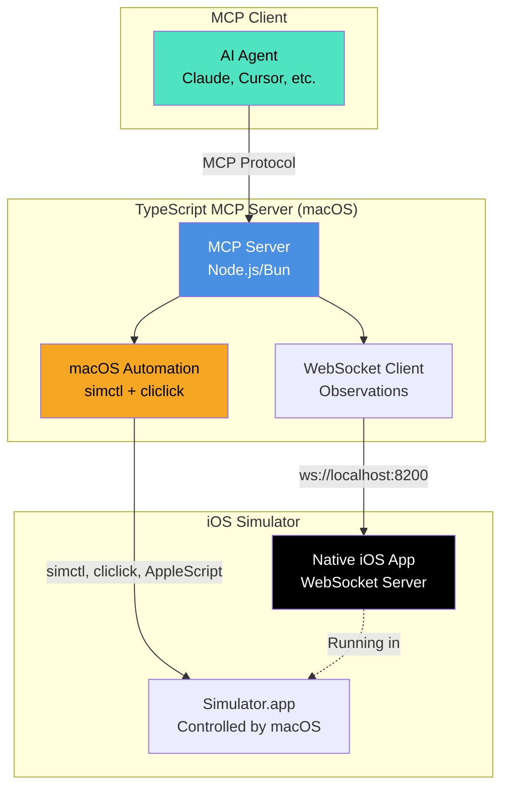

# iOS Automation - Hybrid Architecture

A high-performance iOS simulator automation approach combining native WebSocket server with TypeScript MCP.

## Overview

AutoMobile's iOS automation uses a hybrid architecture that splits responsibilities into two specialized components:

1. **Native iOS WebSocket Server** - Fast accessibility tree queries using UIKit APIs
2. **TypeScript MCP Server** - System control, touch injection, and orchestration using macOS tools

### Key Benefits

- ⚡ **5-10x faster observations** - WebSocket push vs HTTP polling
- 🎯 **No private APIs** - iOS app uses only public UIKit APIs
- 🔧 **Clean separation** - Observations vs control
- 📦 **Simple deployment** - Regular iOS app, no test target needed
- 🚀 **Better performance** - Native speed for queries, macOS automation for control

## Architecture



## Component Responsibilities

### Native iOS WebSocket Server (Swift/UIKit)

**Responsibilities:**
- Serve accessibility tree via WebSocket
- Fast element queries (by ID, text, type)
- Real-time view hierarchy updates
- First responder detection
- Element bounds calculation

**What it does NOT do:**
- Touch injection (handled by TypeScript/macOS)
- App lifecycle management (handled by simctl)
- Device management (handled by simctl)

### TypeScript MCP Server (Node.js/Bun)

**Responsibilities:**
- MCP protocol implementation
- WebSocket client to iOS app
- macOS automation orchestration
- Device management (simctl)
- App lifecycle (launch, terminate, install)
- Touch injection coordination
- State management

## Tool Implementation Matrix

| MCP Tool | Component | Implementation |
|----------|-----------|----------------|
| **observe** | 🟢 iOS WebSocket | `iosApp.getViewHierarchy()` |
| **tapOn** | 🟡 Hybrid | Find (iOS) + Tap (macOS) |
| **swipeOn** | 🔵 macOS | `macOS.swipe()` |
| **scroll** | 🟡 Hybrid | Swipe + Check visibility (iOS) |
| **inputText** | 🔵 macOS | Keyboard events or clipboard |
| **clearText** | 🔵 macOS | Select all + Delete |
| **pressButton** | 🔵 macOS | `simulator.pressHomeButton()` |
| **openLink** | 🔵 macOS | `simulator.openUrl()` |
| **launchApp** | 🔵 macOS | `simulator.launchApp()` |
| **terminateApp** | 🔵 macOS | `simulator.terminateApp()` |
| **installApp** | 🔵 macOS | `simulator.installApp()` |
| **listApps** | 🔵 macOS | `simulator.listApps()` |
| **listDevices** | 🔵 macOS | simctl list |
| **startDevice** | 🔵 macOS | simctl boot |
| **rotate** | 🔵 macOS | `simulator.setOrientation()` |
| **enableDemoMode** | 🔵 macOS | simctl status_bar override |

**Legend:**
- 🟢 iOS WebSocket (Fast observations)
- 🔵 TypeScript/macOS (System control)
- 🟡 Hybrid (Coordination)

## Performance Comparison

### WebDriverAgent vs Hybrid Architecture

| Metric | WebDriverAgent (HTTP) | Hybrid Architecture | Improvement |
|--------|----------------------|---------------------|-------------|
| **View Hierarchy Query** | 50-100ms | 5-20ms | **5-10x faster** |
| **Element Search** | 50-100ms | 5-20ms | **5-10x faster** |
| **Tap Execution** | 50-100ms | 10-30ms | **2-5x faster** |
| **Connection Type** | HTTP (new TCP/req) | WebSocket (persistent) | Lower latency |
| **Throughput** | ~10-20 req/sec | ~100+ msg/sec | **5-10x higher** |
| **Real-time Updates** | Polling required | Push notifications | Instant |

### Latency Breakdown

**WebDriverAgent:**
```
Total: ~100ms per operation
├─ TCP connection: 10ms
├─ HTTP request: 10ms
├─ WDA processing: 50ms
└─ HTTP response: 30ms
```

**Hybrid Architecture:**
```
Total: ~20ms per observation
├─ WebSocket send: 1ms
├─ iOS processing: 15ms
└─ WebSocket receive: 4ms

Total: ~25ms per tap
├─ Find element (WS): 10ms
└─ macOS tap: 15ms
```

## Implementation Overview

### 1. Native iOS WebSocket Server

The iOS app runs a WebSocket server on port 8200 and provides accessibility tree data:

**Core Components:**
- `WebSocketServer.swift` - WebSocket server using Network.framework
- `ViewHierarchyExtractor.swift` - UIKit accessibility tree extraction
- `ElementFinder.swift` - Fast element search algorithms
- `CommandHandler.swift` - WebSocket message processing

**WebSocket Protocol:**

```json
// Client → Server (Command)
{
  "id": "cmd_abc123",
  "action": "getViewHierarchy",
  "params": {}
}

// Server → Client (Response)
{
  "id": "cmd_abc123",
  "status": "success",
  "result": {
    "timestamp": 1704067200.5,
    "screenSize": { "width": 390, "height": 844 },
    "elements": [
      {
        "id": "UIButton_67890",
        "type": "UIButton",
        "label": "Submit",
        "identifier": "submitButton",
        "frame": { "x": 100, "y": 400, "width": 190, "height": 44 },
        "isEnabled": true,
        "isVisible": true,
        "traits": ["button"]
      }
    ]
  }
}
```

### 2. TypeScript MCP Integration

The MCP server orchestrates iOS automation using WebSocket for observations and macOS tools for control:

**Core Components:**
- `ios-websocket-client.ts` - WebSocket client for iOS app
- `macos-automation.ts` - Touch injection using cliclick/CGEvent
- `simulator-controller.ts` - simctl wrapper for device management
- `native-ios-robot.ts` - Unified robot interface

**Example Usage:**

```typescript
const robot = new NativeIosRobot(simulatorUUID);
await robot.connect();

// Fast observation via WebSocket
const elements = await robot.getElementsOnScreen();

// Hybrid interaction: Find (iOS) + Tap (macOS)
await robot.tapOn({ text: 'Submit' });

// macOS system control
await robot.setOrientation('landscape');
```

### 3. macOS Touch Injection

Touch automation uses macOS-native tools to control the simulator:

**Prerequisites:**
```bash
# Install cliclick for mouse automation
brew install cliclick
```

**Approach:**
1. Query element bounds from iOS WebSocket
2. Calculate simulator window position using AppleScript
3. Inject mouse events at correct screen coordinates
4. Execute via `cliclick` or custom Swift helper binary

**Alternative Swift Helper:**
```swift
// Compile: swiftc -o SimulatorTouchHelper SimulatorTouchHelper.swift
let point = CGPoint(x: x, y: y)
CGEvent(mouseEventSource: nil, mouseType: .leftMouseDown,
        mouseCursorPosition: point, mouseButton: .left)?.post(tap: .cghidEventTap)
```

## Deployment Strategy

### 1. Build Native iOS App

```bash
# Build for simulator
xcodebuild \
    -project NativeAutomationServer.xcodeproj \
    -scheme NativeAutomationServer \
    -sdk iphonesimulator \
    -configuration Release \
    -derivedDataPath ./build

APP_PATH="./build/Build/Products/Release-iphonesimulator/NativeAutomationServer.app"
```

### 2. Install and Launch

```typescript
async function setupAutomationServer(simulatorUUID: string): Promise<void> {
    const appPath = path.join(__dirname, '../ios-app/NativeAutomationServer.app');
    const bundleId = 'com.yourcompany.NativeAutomationServer';

    // Install app
    await execFileAsync('xcrun', ['simctl', 'install', simulatorUUID, appPath]);

    // Launch app
    await execFileAsync('xcrun', ['simctl', 'launch', simulatorUUID, bundleId]);

    // Wait for WebSocket server to start
    await sleep(2000);

    // Connect
    const client = new IosWebSocketClient(8200);
    await client.connect();

    return client;
}
```

### 3. Package Distribution

**Option A: Bundle with MCP**
```json
{
  "name": "@kaeawc/auto-mobile",
  "files": [
    "lib",
    "ios-app/NativeAutomationServer.app"
  ]
}
```

**Option B: Download on First Use**
```typescript
async function downloadAutomationApp(): Promise<string> {
    const url = 'https://github.com/kaeawc/auto-mobile/releases/latest/download/NativeAutomationServer.zip';
    const cachePath = path.join(os.homedir(), '.auto-mobile/ios-automation-server');
    // Download and extract...
    return path.join(cachePath, 'NativeAutomationServer.app');
}
```

## Example Workflows

### Login Flow

```typescript
const robot = new NativeIosRobot(simulatorUUID);
await robot.connect();

// Launch app (via simctl)
await robot.launchApp('com.example.myapp');

// Find and tap username field (Hybrid: iOS find + macOS tap)
await robot.tapOn({ id: 'usernameField' });

// Type username (via macOS keyboard injection)
await robot.inputText('testuser@example.com');

// Tap login button
await robot.tapOn({ text: 'Login' });

// Verify success
await robot.scrollUntilVisible({ text: 'Welcome' });
```

### Data Extraction

```typescript
const robot = new NativeIosRobot(simulatorUUID);
await robot.connect();

const allItems: string[] = [];
let previousCount = 0;

while (true) {
    // Fast observation via WebSocket
    const elements = await robot.getElementsOnScreen();

    const items = elements
        .filter(el => el.className.includes('UITableViewCell'))
        .map(el => el.text);

    allItems.push(...items);

    if (items.length === previousCount) break;
    previousCount = items.length;

    // Scroll via macOS
    await robot.swipe('up');
    await sleep(500);
}

console.log('Extracted items:', allItems);
```

## System Requirements

- **macOS** - macOS 13.0 (Ventura) or later
- **Xcode** - Xcode 15.0 or later
- **Command Line Tools** - Xcode Command Line Tools installed
- **Bun/Node.js** - Bun 1.3.5+ or Node.js 18+
- **cliclick** - Install via `brew install cliclick`

## Current Status

The hybrid iOS automation architecture is **in active development**:

- ✅ Architecture design complete
- ✅ Protocol specification defined
- 🚧 Native iOS WebSocket server implementation
- 🚧 TypeScript MCP integration
- 🚧 macOS automation layer
- ⏳ Testing and optimization
- ⏳ Documentation and examples

## Limitations

### macOS Required

This approach requires macOS for:
- Xcode and iOS Simulator
- macOS automation tools (simctl, cliclick, AppleScript)
- Touch injection via CGEvent

### Docker Not Supported

Unlike Android, iOS automation **cannot run in Docker** because:
- iOS Simulator requires macOS and Apple hardware
- Xcode is required for building and running the native app
- No viable containerization solution exists

### Simulator Only (Initially)

Physical device support requires:
- WebDriverAgent or similar solution for touch injection
- USB/network communication to device
- Proper code signing and provisioning

The hybrid architecture focuses on simulator automation first, with physical device support planned for future releases.

## See Also

- [Android Implementation](../android/index.md) - Android automation architecture
- [MCP Server](../../mcp/index.md) - Platform-agnostic MCP integration
- [MCP Actions](../../mcp/actions.md) - Available MCP tools
- [Navigation Graph](../../mcp/navigation-graph.md) - Screen flow mapping
