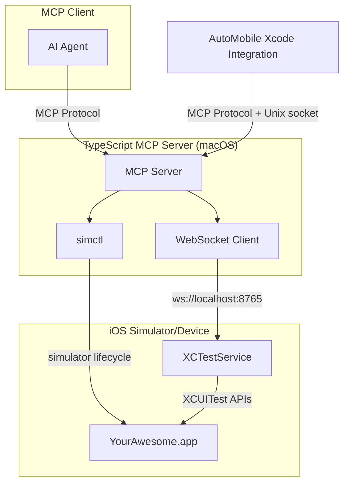

# Overview

AutoMobile iOS automation uses native XCTest APIs for both observations and touch injection.
The XCTestService provides a WebSocket server that exposes XCUITest capabilities, while
simctl handles simulator lifecycle management.

## Components

- [XCTestService](xctestrunner.md) - WebSocket server using native XCUITest APIs for element location and touch injection.
- [simctl integration](simctl.md) - simulator lifecycle and app management.
- [Managed App Configuration](managed-app-config.md) - MDM policies and app config payloads.
- [Managed Apple IDs](managed-apple-ids.md) - account policies and device profiles.
- [XCTest runner](xctestrunner.md) - plan execution and timing integration.
- [Xcode integration](ide-plugin/overview.md) - companion app + source editor extension.

## Status

- Architecture design complete.
- XCTestService with WebSocket server and native XCUITest touch injection implemented.
- Xcode companion app scaffolded.
- Physical device support tracked in GitHub issues #912, #913, #914.

## Parity goal

The iOS toolset should reach feature parity with Android over time. The design
prioritizes consistent behavior and comparable UX across platforms, even when the
underlying system tooling differs.

## System requirements

- macOS 13.0+ (Ventura or newer).
- Xcode 15.0+ and Command Line Tools.
- Bun 1.3.5+ or Node.js 18+ for the MCP server.

## Limitations

- macOS required (Xcode and iOS Simulator).
- Simulator-only currently; physical device support requires provisioning (see GitHub issues #912-914).
- Docker is not supported for iOS automation.

## See also

- [MCP server](../../mcp/index.md)
- [MCP actions](../../mcp/tools.md)
