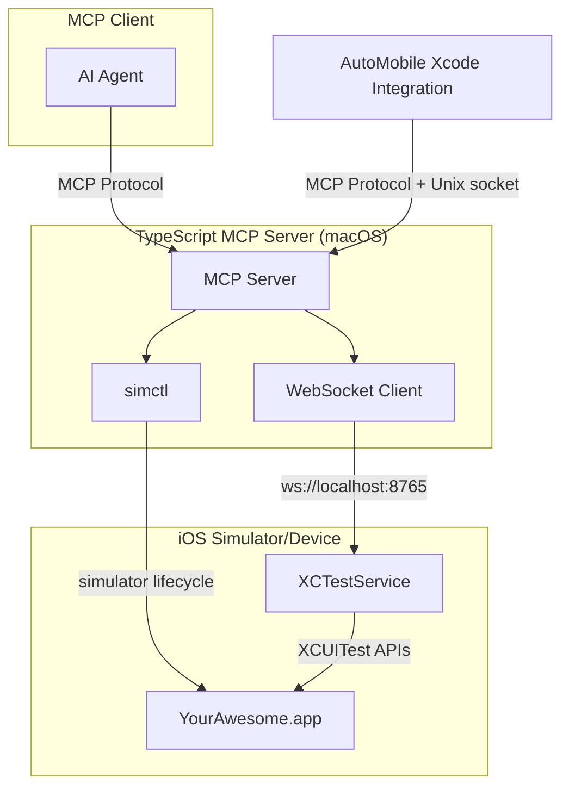

# Overview

<kbd>✅ Implemented</kbd> <kbd>🧪 Tested</kbd> <kbd>📱 Simulator Only</kbd>

> See the [Status Glossary](../../status-glossary.md) for chip definitions.

AutoMobile iOS automation uses native XCTest APIs for both observations and touch injection.
The XCTestService provides a WebSocket server that exposes XCUITest capabilities, while
simctl handles simulator lifecycle management.

## Components

| Component | Description | Status |
|-----------|-------------|--------|
| [XCTestService](xctestservice.md) | WebSocket server using native XCUITest APIs for element location and touch injection. | <kbd>✅ Implemented</kbd> <kbd>🧪 Tested</kbd> <kbd>📱 Simulator Only</kbd> |
| [XCTestRunner](xctestrunner.md) | Test execution framework (plan execution, test ordering, retries). | <kbd>✅ Implemented</kbd> <kbd>🧪 Tested</kbd> |
| [simctl integration](simctl.md) | Simulator lifecycle and app management. | <kbd>✅ Implemented</kbd> <kbd>🧪 Tested</kbd> |
| [Managed App Configuration](managed-app-config.md) | MDM policies and app config payloads. | <kbd>🚧 Design Only</kbd> |
| [Managed Apple IDs](managed-apple-ids.md) | Account policies and device profiles. | <kbd>🚧 Design Only</kbd> |
| [Xcode integration](ide-plugin/overview.md) | Companion macOS app + source editor extension. | <kbd>⚠️ Partial</kbd> |
| [Screen Streaming](screen-streaming.md) | AVFoundation/ScreenCaptureKit live mirroring. | <kbd>🚧 Design Only</kbd> |

## Status

- XCTestService fully implemented: WebSocket server, XCUITest element location, gesture injection, hierarchy debouncing, FPS monitoring.
- XCTestRunner fully implemented: `AutoMobileTestCase` base class, plan execution, retry, test ordering by timing, CI/local modes.
- Xcode Companion app (macOS): scaffolded with all views; feature completeness ongoing.
- Xcode Source Editor Extension: scaffolded with 5 registered commands; implementations are minimal stubs.
- Physical device support tracked in GitHub issues [#912](https://github.com/jasonpearson/auto-mobile/issues/912), [#913](https://github.com/jasonpearson/auto-mobile/issues/913), [#914](https://github.com/jasonpearson/auto-mobile/issues/914).

## Parity goal

The iOS toolset should reach feature parity with Android over time. The design
prioritizes consistent behavior and comparable UX across platforms, even when the
underlying system tooling differs.

## System requirements

- macOS 13.0+ (Ventura or newer).
- Xcode 15.0+ and Command Line Tools.

## Limitations

- macOS required (Xcode and iOS Simulator).
- Simulator-only currently; physical device support requires provisioning (see GitHub issues #912-914).
- Docker is not supported for iOS automation.

## See also

- [MCP server](../../mcp/index.md)
- [MCP tool reference](../../mcp/tools.md)
