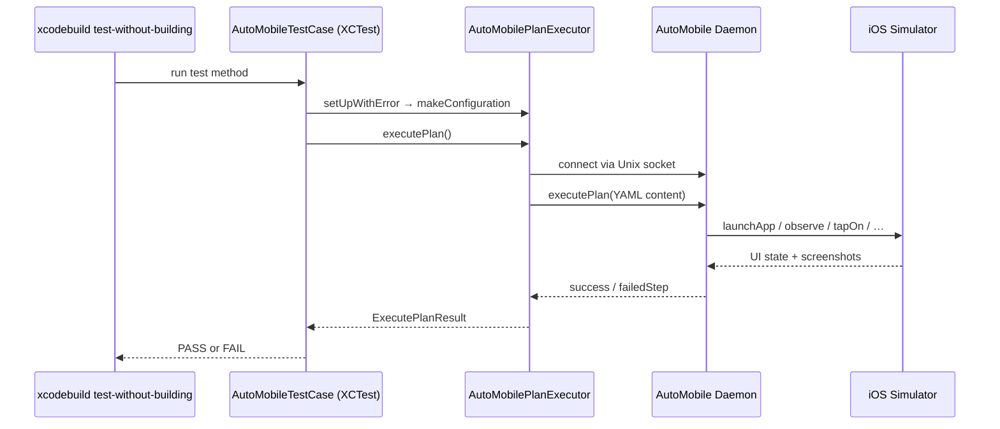

# XCTestRunner

<kbd>✅ Implemented</kbd> <kbd>🧪 Tested</kbd> <kbd>📱 Simulator Only</kbd>

> **Current state:** `XCTestRunner` is a fully implemented Swift package (`ios/XCTestRunner/`) with
> `AutoMobileTestCase`, `AutoMobilePlanExecutor`, `AutoMobileTestObserver`, `TestTimingCache`, and
> `AutoMobileSession`. Plans execute against a booted iOS Simulator via the AutoMobile daemon over a
> Unix domain socket. Published as a local SPM package; remote GitHub release in progress. See the
> [Status Glossary](../../../status-glossary.md) for chip definitions.

The AutoMobile XCTestRunner lets you write host-side XCTest classes that drive a real iOS Simulator
over the AutoMobile daemon. Tests execute as ordinary unit tests inside a dedicated test target, so
they run with `xcodebuild test-without-building` with no separate UI test runner process required.

## How it works



Each test class points to a YAML plan file bundled with the test target. The executor encodes the
plan and sends it to the AutoMobile daemon over a Unix domain socket. The daemon drives the
simulator step by step and returns a structured result. No separate UI test process or XCUITest
runner binary is involved.

## Why not XCUITest directly?

|  | AutoMobile XCTestRunner | XCUITest |
|---|---|---|
| **Runs as** | Unit test target | UI test target (separate process) |
| **Build required** | Pre-built `.xctestrun` reused | Full UI test host recompile |
| **Device needed at** | Test execution only | Build time (linking) + execution |
| **Parallel devices** | Daemon-managed pool | One device per test bundle |
| **AI recovery** | Optional self-healing | Not available |
| **Test authoring** | YAML plans or AI prompt | Swift/Objective-C code |
| **App under test** | Any installed app | App compiled into UI test host |

## Requirements

- macOS 13.0+ (Ventura or newer)
- Xcode 15.0+ and Command Line Tools
- A booted iOS Simulator
- AutoMobile daemon running (`auto-mobile --daemon start`)
- CtrlProxy iOS installed in the simulator (see [CtrlProxy iOS](../ctrl-proxy-ios.md))

## Quick start

### 1. Add the dependency

=== "Local path (current)"
    ```yaml
    # ios/YourApp/project.yml (XcodeGen)
    packages:
      XCTestRunner:
        path: ../../libs/spm/XCTestRunner
    ```

=== "Remote (once published)"
    ```yaml
    # ios/YourApp/project.yml (XcodeGen)
    packages:
      XCTestRunner:
        url: https://github.com/kaeawc/auto-mobile
        from: "0.0.14"
    ```

    ```swift
    // Package.swift
    .package(url: "https://github.com/kaeawc/auto-mobile", from: "0.0.14")
    ```

See [Project Setup → Dependency](project-setup.md#dependency) for the full XcodeGen target
configuration and instructions for committing a local copy for CI reproducibility.

### 2. Write a test

```swift
// YourApp/Tests/AutoMobile/AppLaunchAutoMobileTests.swift
import XCTest
import XCTestRunner

final class AppLaunchAutoMobileTests: AutoMobileTestCase {

    override var planPath: String {
        "test-plans/launch-app.yaml"
    }

    override var cleanupOptions: AutoMobilePlanExecutor.CleanupOptions? {
        AutoMobilePlanExecutor.CleanupOptions(
            appId: "com.example.ios.YourApp",
            clearAppData: true
        )
    }

    override func setUpAutoMobile() throws {
        let daemonReady = DaemonManager.ensureDaemonRunning()
        guard daemonReady else {
            throw XCTSkip("AutoMobile daemon is not running and could not be started")
        }
    }

    func testAppLaunchesWithoutCrashing() throws {
        let result = try executePlan()
        XCTAssertTrue(result.success, "Plan failed: \(result.error ?? "unknown error")")
        XCTAssertGreaterThan(result.executedSteps, 0)
    }
}
```

### 3. Write the plan

```yaml
# YourApp/Tests/AutoMobile/test-plans/launch-app.yaml
name: launch-app
description: Launch the app and verify it opens without crashing
platform: ios
steps:
  - tool: launchApp
    appId: com.example.ios.YourApp
    clearAppData: true
    label: Launch the app with a clean state

  - tool: observe
    label: Verify the app UI renders without crashing

  - tool: terminateApp
    appId: com.example.ios.YourApp
    label: Terminate the app after test
```

### 4. Run

```bash
# Start the daemon (if not already running)
auto-mobile --daemon start &

# Build for testing
xcodebuild build-for-testing \
  -scheme YourApp \
  -destination 'platform=iOS Simulator,name=iPhone 16' \
  -derivedDataPath build/DerivedData

# Run only the AutoMobile test bundle
xcodebuild test-without-building \
  -xctestrun build/DerivedData/Build/Products/*.xctestrun \
  -destination 'platform=iOS Simulator,name=iPhone 16' \
  -only-testing:YourAppAutoMobileTests
```

See [Project Setup → Running tests locally](project-setup.md#running-tests-locally) for the full
step-by-step walkthrough.

## Pages in this section

| Page | What it covers |
|---|---|
| [Project Setup](project-setup.md) | SPM dependency, XcodeGen config, test target setup, running locally |
| [Writing Tests](writing-tests.md) | `AutoMobileTestCase` properties, YAML plan reference, examples |
| [CI Integration](ci-integration.md) | GitHub Actions, build-for-testing artifact, daemon setup |

## Related

- [CtrlProxy iOS](../ctrl-proxy-ios.md) — Required for view hierarchy access and gesture injection
- [MCP Tools reference](../../../mcp/tools.md) — Full list of tools available in YAML plans
- [simctl integration](../simctl.md) — Simulator lifecycle management
