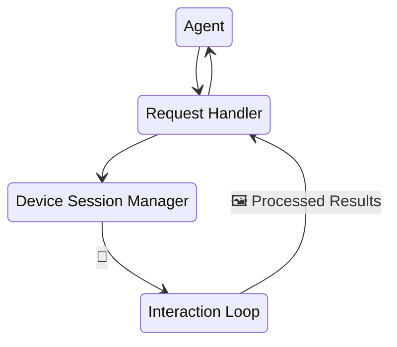

# Features - MCP Server

AutoMobile's MCP makes its various [actions](actions.md) available as tool calls, exposes device state through
[resources](resources.md), and automatically performs [observations](observation.md) within an
[interaction loop](interaction-loop.md). This is a simple overview diagram, for more detail see the
[full MCP server system design](system-design.md).


```mermaid
stateDiagram-v2
  Agent: Agent
  RequestHandler: Request Handler
  DeviceSessionManager: Device Session Manager
  InteractionLoop: Interaction Loop

  Agent --> RequestHandler
  RequestHandler --> Agent
  RequestHandler --> DeviceSessionManager
  InteractionLoop --> RequestHandler: 🖼️ Processed Results
  DeviceSessionManager --> InteractionLoop: 📱
```

## Configuration

AutoMobile MCP defaults to STDIO mode (good for workstations and CI automation). Streamable HTTP is available for
clients that need HTTP transports; SSE exists but is deprecated in favor of streamable HTTP.

```shell
npx -y @kaeawc/auto-mobile@latest
```

If you have a private npm registry you can instead do the following

```shell
npx --registry https://your.awesome.private.registry.net/path/to/npm/proxy -y @kaeawc/auto-mobile@latest
```

A lot of MCP clients configure MCP servers through JSON, this sample will work with most

```json
{
  "mcpServers": {
    "AutoMobile": {
      "command": "npx",
      "args": ["-y", "@kaeawc/auto-mobile@latest"]
    }
  }
}
```

Configuration is provided via CLI flags and environment variables, and runtime feature flags can be toggled through MCP
tools when needed.

## Implementation references

- [`src/index.ts#L61-L169`](https://github.com/kaeawc/auto-mobile/blob/main/src/index.ts#L61-L169) for transport defaults and CLI flags.
- [`src/index.ts#L657-L681`](https://github.com/kaeawc/auto-mobile/blob/main/src/index.ts#L657-L681) for STDIO default and streamable/SSE transport selection (including SSE deprecation logging).
- [`src/server/featureFlagTools.ts#L11-L54`](https://github.com/kaeawc/auto-mobile/blob/main/src/server/featureFlagTools.ts#L11-L54) for runtime feature-flag tool support.
