# Features - MCP Server

AutoMobile's MCP makes its various [actions](actions.md) available as tool calls and automatically performs
[observations](observation.md) within an [interaction loop](interaction-loop.md). This is a simple overview diagram,
for more detail see the [full MCP server system design](system-design.md).

```mermaid
stateDiagram-v2
  Agent: Agent
  RequestHandler: Request Handler
  DeviceSessionManager: Device Session Manager
  InteractionLoop: Interaction Loop
  AuthorTest: Author Test

  Agent --> RequestHandler
  RequestHandler --> Agent
  RequestHandler --> DeviceSessionManager
  InteractionLoop --> RequestHandler: 🖼️ Processed Results
  DeviceSessionManager --> InteractionLoop: 📱
  RequestHandler --> AuthorTest: on App Stopped

```



## Configuration

AutoMobile MCP is designed to be run in STDIO mode in production settings like workstations and CI automation.

```shell
npx -y auto-mobile@latest
```

If you have a private npm registry you can instead do the following

```shell
npx --registry https://your.awesome.private.registry.net/path/to/npm/proxy -y auto-mobile@latest
```

A lot of MCP clients configure MCP servers through JSON, this sample will work with most

```json
{
  "mcpServers": {
    "AutoMobile": {
      "command": "npx",
      "args": ["-y", "auto-mobile@latest"]
    }
  }
}
```
