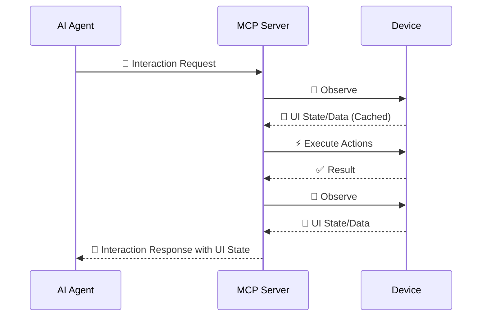

# Features - MCP Server - Interaction Loop

This interaction loop is supported by comprehensive [observation](observation.md) of UI state and UI stability checks
(Android uses `dumpsys gfxinfo`-based idle detection) before and after action execution. Together, that allows for
accurate and precise exploration with the [action tool calls](actions.md).

```mermaid
sequenceDiagram
    participant Agent as AI Agent
    participant MCP as MCP Server
    participant Device as Device

    Agent->>MCP: 🤖 Interaction Request
    MCP->>Device: 👀 Observe
    Device-->>MCP: 📱 UI State/Data (Cached)

    MCP->>Device: ⚡ Execute Actions
    Device-->>MCP: ✅ Result

    MCP->>Device: 👀 Observe
    Device-->>MCP: 📱 UI State/Data
    MCP-->>Agent: 🔄 Interaction Response with UI State
```

## Implementation references

- [`src/features/action/BaseVisualChange.ts#L41-L210`](https://github.com/kaeawc/auto-mobile/blob/main/src/features/action/BaseVisualChange.ts#L41-L210) for observed interaction flow (pre/post observation and stability checks).
- [`src/features/observe/AwaitIdle.ts#L36-L170`](https://github.com/kaeawc/auto-mobile/blob/main/src/features/observe/AwaitIdle.ts#L36-L170) for gfxinfo-based UI idle detection on Android.
- [`src/features/observe/ObserveScreen.ts#L314-L385`](https://github.com/kaeawc/auto-mobile/blob/main/src/features/observe/ObserveScreen.ts#L314-L385) for observation collection used in the loop.
