# Features - MCP Server - Interaction Loop

This interaction loop is supported by comprehensive [observation](observation.md) of UI state and performant
frame rate observation to determine UI idling. Together, that allows for accurate and precise exploration with the
[action tool calls](actions.md).

```mermaid
sequenceDiagram
    participant Agent as AI Agent
    participant MCP as MCP Server
    participant Device as Device

    Agent->>MCP: 🤖 Interaction Request
    MCP->>Device: 👀 Observe
    Device-->>MCP: 📱 UI State/Data (Cached)

    MCP->>Device: ⚡ Execute Actions
    Device-->>MCP: ✅ Result

    MCP->>Device: 👀 Observe
    Device-->>MCP: 📱 UI State/Data
    MCP-->>Agent: 🔄 Interaction Response with UI State
```

