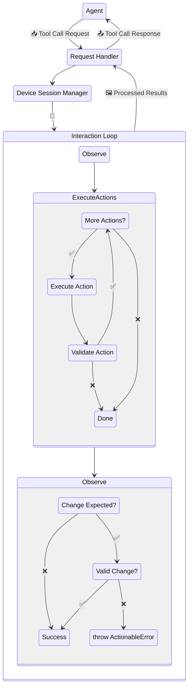

# Features - MCP Server - System Design

AutoMobile's MCP makes its various [actions](actions.md) available as tool calls and automatically performs
[observations](observation.md) within an [interaction loop](interaction-loop.md).

```mermaid
stateDiagram-v2
    Agent: Agent
    RequestHandler: Request Handler
    DeviceSessionManager: Device Session Manager
    InteractionLoop: Interaction Loop
    InitialObserve: Observe
    FinalObserve: Observe
    MoreActions?: More Actions?
    ExecuteAction: Execute Action
    ValidateAction: Validate Action
    ChangeExpected?: Change Expected?
    ValidChange: Valid Change?
    ActionableError: throw ActionableError
    
        Agent --> RequestHandler : 📥 Tool Call Request
        RequestHandler --> Agent : 📤 Tool Call Response
        RequestHandler --> DeviceSessionManager
        InteractionLoop --> RequestHandler: 🖼️ Processed Results 
        DeviceSessionManager --> InteractionLoop: 📱
    state InteractionLoop {
        InitialObserve --> ExecuteActions
        ExecuteActions --> FinalObserve

        
        state ExecuteActions {
          MoreActions? --> ExecuteAction: ✅
            ExecuteAction --> ValidateAction
            ValidateAction --> MoreActions?: ✅
            ValidateAction --> Done: ❌
            MoreActions? --> Done: ❌
        }
        
        state FinalObserve {
            ChangeExpected? --> ValidChange: ✅
            ChangeExpected? --> Success: ❌
            ValidChange --> Success: ✅
            ValidChange --> ActionableError: ❌
        }
    }
```

## Implementation references

- [`src/server/index.ts#L1-L160`](https://github.com/kaeawc/auto-mobile/blob/main/src/server/index.ts#L1-L160) for MCP request handling and tool/resource registration.
- [`src/server/toolRegistry.ts#L33-L200`](https://github.com/kaeawc/auto-mobile/blob/main/src/server/toolRegistry.ts#L33-L200) for device/session-aware tool execution.
- [`src/features/action/BaseVisualChange.ts#L41-L210`](https://github.com/kaeawc/auto-mobile/blob/main/src/features/action/BaseVisualChange.ts#L41-L210) for the observe → action → observe flow used by action tools.
