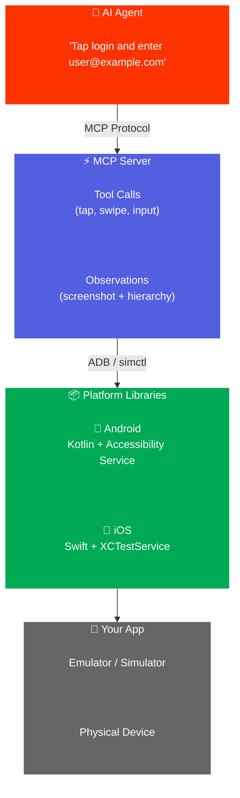

# AutoMobile

**AutoMobile lets AI agents control your mobile devices using natural language.** Tell an AI what you want to do, and it interacts with your Android or iOS app.

It can do all this by being an MCP server that uses standard platform tools like adb & simctl paired with additional Kotlin & Swift libraries and apps. All components are open source. The point is to provide mobile engineers with AI workflow tools to perform UX deep dives, reproduce bugs, and run automated tests.


*An AI agent navigating to the Clock app, creating a new alarm*


*An AI agent searching YouTube and browsing results*

## What can I do with AutoMobile?

### Explore and Test

| Task | What it does |
|------|-------------|
| **[Explore app UX](using/ux-exploration.md)** | Navigate your app, discover screens, map user flows, identify confusing interactions |
| **[Reproduce bugs](using/reproducting-bugs.md)** | Paste a bug report and get exact reproduction steps with screenshots |
| **[Create UI tests](using/ui-tests.md)** | Describe test scenarios in plain English, get executable test plans |

### Audit Quality

| Task | What it does |
|------|-------------|
| **[Measure startup time](using/perf-analysis/startup.md)** | Profile cold and warm launch performance |
| **[Check scroll performance](using/perf-analysis/scroll-framerate.md)** | Detect jank and dropped frames |
| **[Audit contrast](using/a11y/contrast.md)** | Find accessibility issues with color contrast |
| **[Check tap targets](using/a11y/tap-targets.md)** | Ensure touch targets meet size guidelines |

## Get Started

### Option 1: Claude Code Plugin (Recommended)

Install the [AutoMobile plugin](https://github.com/kaeawc/auto-mobile) for Claude Code. It includes:

- Pre-configured MCP server setup
- **Skills** for common workflows:
  - `/explore` - Navigate and interact with devices
  - `/reproduce-bug` - Document exact bug reproduction steps
  - `/apps`, `/gesture`, `/text`, `/system` - Focused interaction commands
  - `/snapshot` - Save and restore device state
  - `/doctor` - Diagnose setup issues

### Option 2: Manual Installation

See the [installation guide](install/overview.md) for:

- Interactive installer (macOS)
- MCP configuration for Claude Desktop, Cursor, Codex, and other clients
- Docker setup for CI environments

## How it works


```mermaid
flowchart TB
    subgraph Agent["🤖 AI Agent"]
        Prompt["'Tap login and enter user@example.com'"]
    end

    subgraph MCP["⚡ MCP Server"]
        Tools["Tool Calls<br/>(tap, swipe, input)"]
        Observe["Observations<br/>(screenshot + hierarchy)"]
    end

    subgraph Platform["📦 Platform Libraries"]
        Android["🤖 Android<br/>Kotlin + Accessibility Service"]
        iOS["🍎 iOS<br/>Swift + XCTestService"]
    end

    subgraph Device["📱 Your App"]
        Emulator["Emulator / Simulator"]
        Physical["Physical Device"]
    end

    Agent -->|MCP Protocol| MCP
    MCP -->|ADB / simctl| Platform
    Platform --> Device

    classDef agent fill:#FF3300,stroke-width:0px,color:white;
    classDef mcp fill:#525FE1,stroke-width:0px,color:white;
    classDef platform fill:#00AA55,stroke-width:0px,color:white;
    classDef device fill:#666666,stroke-width:0px,color:white;

    class Agent,Prompt agent;
    class MCP,Tools,Observe mcp;
    class Platform,Android,iOS platform;
    class Device,Emulator,Physical device;
```

The MCP server exposes [tool calls](design-docs/mcp/tools.md) for actions like tap, swipe, and text input. It automatically captures [observations](design-docs/mcp/observe/index.md) (screenshots + view hierarchy) so the AI agent can see what's on screen.

## Platform Support

| Platform | Status | Notes |
|----------|--------|-------|
| **Android** | Fully supported | Emulators and physical devices |
| **iOS** | Simulator support | Physical device support coming ([#912](https://github.com/kaeawc/auto-mobile/issues/912), [#913](https://github.com/kaeawc/auto-mobile/issues/913), [#914](https://github.com/kaeawc/auto-mobile/issues/914)) |

Platform-specific setup:

- [Android setup](install/plat/android.md) - SDK requirements, Docker config, IDE plugin
- [iOS setup](install/plat/ios.md) - Xcode requirements, simulator config

## Resources

- [FAQ](faq.md) - Common questions answered
- [Design Docs](design-docs/index.md) - Architecture and implementation details
- [Contributing](contributing/overview.md) - How to contribute


## License

```
Copyright 2025 Zillow, Inc.
Copyright 2025-2026 Jason Pearson

Licensed under the Apache License, Version 2.0
https://www.apache.org/licenses/LICENSE-2.0
```
