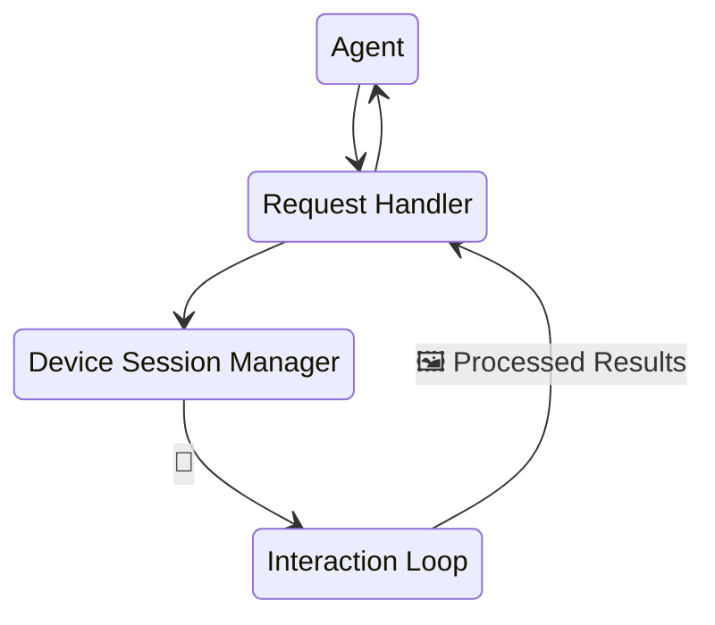

# AutoMobile

AutoMobile is a set of tools for mobile automation. You can use it for UI testing, development workflow
assistant, performance inspection tool, or accessibility audit.

Android is the primary supported platform today; iOS support is on the roadmap.

**How do I get started?**

- [Installation](install/overview.md) - Install AutoMobile in your environment or IDE
- [Design Docs](design-docs/index.md) - Understand how AutoMobile works


```mermaid
stateDiagram-v2
    Agent: Agent
    RequestHandler: Request Handler
    DeviceSessionManager: Device Session Manager
    InteractionLoop: Interaction Loop
    
    Agent --> RequestHandler
    RequestHandler --> Agent
    RequestHandler --> DeviceSessionManager
    InteractionLoop --> RequestHandler: 🖼️ Processed Results 
    DeviceSessionManager --> InteractionLoop: 📱
```

**Additional Resources**

- [FAQ](faq.md) - Frequently asked questions
- [Why build this?](origin.md) - Motivation and origin story
- [Design Docs](design-docs/index.md) - Technical architecture and implementation details
- [Contributing](contributing/index.md) - If you're looking to contribute to the project

## License

```text
Copyright 2025 Zillow, Inc.
Copyright 2025-2026 Jason Pearson

Licensed under the Apache License, Version 2.0 (the "License");
you may not use this file except in compliance with the License.
You may obtain a copy of the License at

   https://www.apache.org/licenses/LICENSE-2.0

Unless required by applicable law or agreed to in writing, software
distributed under the License is distributed on an "AS IS" BASIS,
WITHOUT WARRANTIES OR CONDITIONS OF ANY KIND, either express or implied.
See the License for the specific language governing permissions and
limitations under the License.
```
