# AutoMobile

AutoMobile is a set of tools for mobile automation. You can use it for UI testing or as a development workflow
assistant.

The first platform supported is Android with plans to extend to iOS.

**How do I get started?**

- [Installation](installation.md) - Install AutoMobile in your environment or IDE
- [Test Authoring](features/test-authoring/index.md) - Automatically write tests
- [Test Execution](features/test-execution/index.md) - Run tests locally or on CI

```mermaid
stateDiagram-v2
    Agent: Agent
    RequestHandler: Request Handler
    DeviceSessionManager: Device Session Manager
    InteractionLoop: Interaction Loop
    AuthorTest: Author Test
    
    Agent --> RequestHandler
    RequestHandler --> Agent
    RequestHandler --> DeviceSessionManager
    InteractionLoop --> RequestHandler: 🖼️ Processed Results 
    DeviceSessionManager --> InteractionLoop: 📱
    RequestHandler --> AuthorTest: on App Stopped
    
```



**Additional Resources**

- [FAQ](faq.md) - Frequently asked questions
- [Why build this?](origin.md) - Motivation and origin story
- [Features](features/index.md) - Understand how AutoMobile works 
- [Contributing](contributing/index.md) - If you're looking to contribute to the project

## Acknowledgement

By continuing to use AutoMobile, [you acknowledge and agree to the warnings and responsible use requirements](security.md).

## License

```text
Copyright (C) 2025 Zillow Group

Licensed under the Apache License, Version 2.0 (the "License");
you may not use this file except in compliance with the License.
You may obtain a copy of the License at

   https://www.apache.org/licenses/LICENSE-2.0

Unless required by applicable law or agreed to in writing, software
distributed under the License is distributed on an "AS IS" BASIS,
WITHOUT WARRANTIES OR CONDITIONS OF ANY KIND, either express or implied.
See the License for the specific language governing permissions and
limitations under the License.
```
