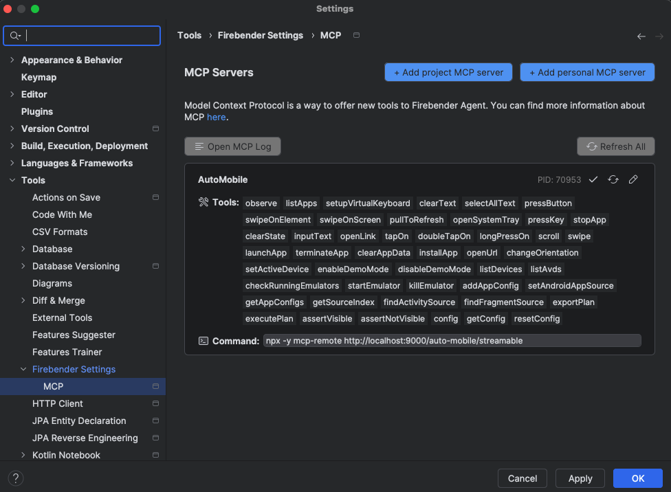

# Running from Source

## Hot Reload (Recommended)

AutoMobile supports multiple transport modes for development:

### Transport Options

**Streamable HTTP (Recommended)** - Modern MCP transport with full streaming support:
```shell
# Start with hot reloading (ts-node-dev)
npm run dev
npm run dev:streamable

# Custom port
npm run dev:streamable:port 8080
```

Configuration for your favorite MCP client:

```json
{
  "mcpServers": {
    "AutoMobile": {
      "command": "npx",
      "args": [
        "-y",
        "mcp-remote",
        "http://localhost:9000/auto-mobile/streamable"
      ]
    }
  }
}
```


