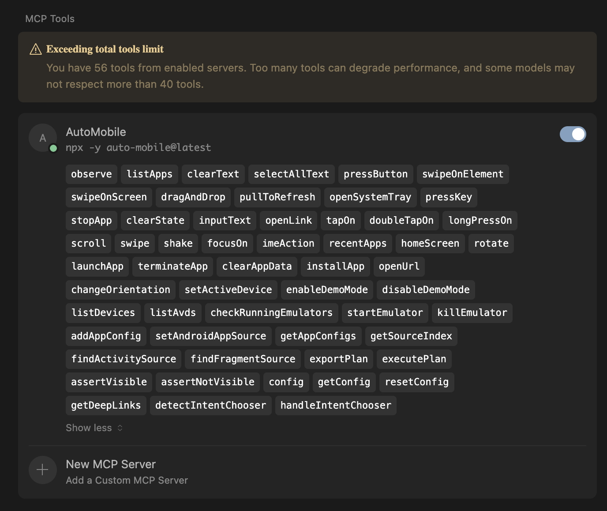

# Firebender MCP Config

This is a simple sample of how to get AutoMobile running with Cursor, for other options see the
[overview](overview.md).

```json
{
  "mcpServers": {
    "AutoMobile": {
      "command": "npx",
      "args": ["-y", "auto-mobile@latest"]
    }
  }
}
```


